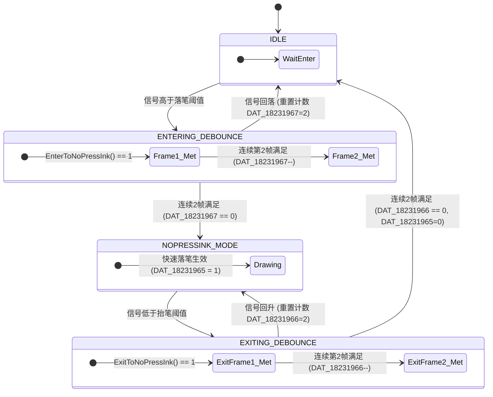
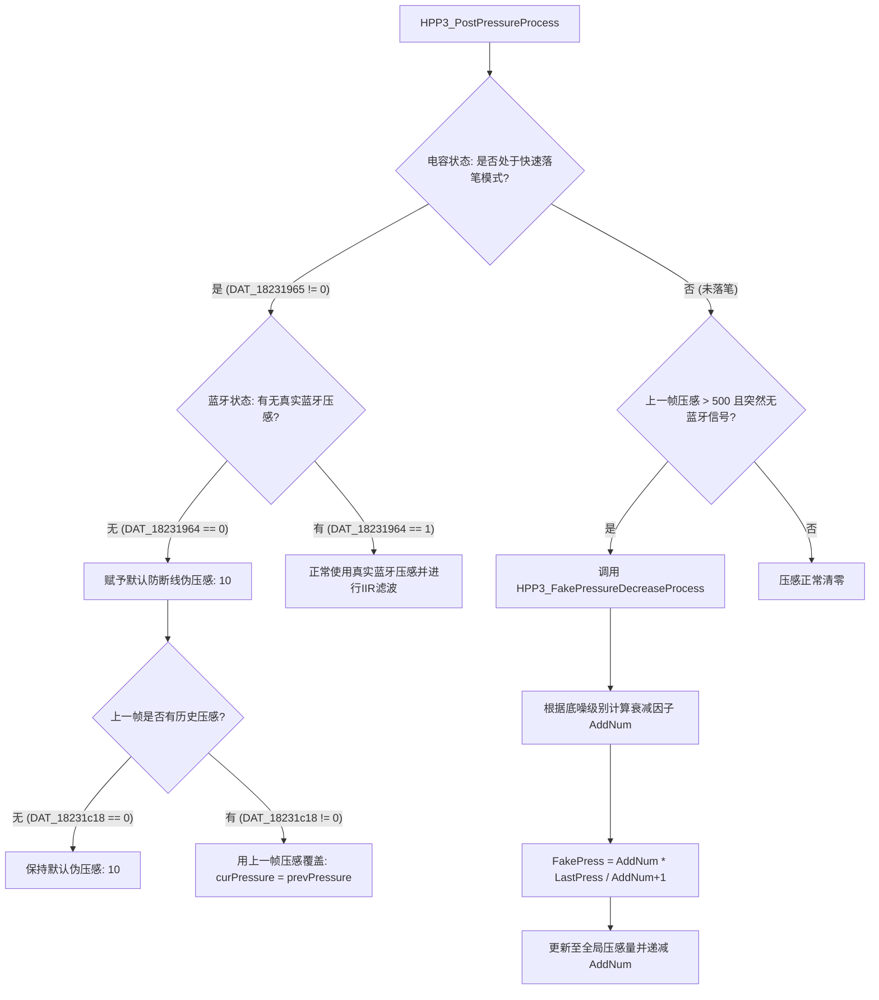

# HPP3 快速落笔/抬笔与无蓝牙压感逻辑分析报告

本报告详细分析了 TSACore 中以 `asa_mainprocess` 为入口，针对 Goodix HPP3 协议的快速落笔（Fast Pen Down / EnterNoPressInk）、快速抬笔（Fast Pen Up / ExitNoPressInk）以及无蓝牙信号时的压感获取逻辑。该算法基于 40x60 的触摸屏以及两个 9x9 的电容热力窗口（对应 TX1 笔尖和 TX2 笔身/笔尾）。

## 1. 信号量的解算方式 (Signal Resolution)

在进行状态机判断前，系统首先从 40x60 的全局电容矩阵中解算出笔尖(TX1)和笔尾(TX2)的信号量。

### 1.1 峰值查找与提取
- **`HPP3_FindPeakOfNormalGrid` / `TX1LinePeaksProcess`**:
  算法遍历 40x60 的屏幕数据。当检测到某个点的信号量大于特定阈值时，会以该点为中心划定 9x9 的窗口。通过二阶导数和邻域极值比较，确认其是否为真正的局部峰值(Peak)。
- **`UpdateLineSignal`**:
  提取 X 轴和 Y 轴的最高峰值，并保存到全局变量中。
  - TX1 X轴峰值: `DAT_18230a76` -> `DAT_18231160`
  - TX1 Y轴峰值: `DAT_18230c26` -> `DAT_18231162`
  - TX1 综合峰值: `DAT_18231164` (根据配置，可能是 X 和 Y 的平均值，或直接取最大值)
  - TX2 (笔尾)的信号量 `DAT_18231166`, `DAT_18231168`, `DAT_1823116a` 采用相同的解算逻辑。

### 1.2 动态阈值计算 (`UpdateNoPressInkThold`)
为了防误触和防飞线，进出无源墨水(NoPressInk)状态的阈值是动态计算的：
1. **坐标查表**: 调用 `GetNopressInkTholdFromLearnedTable(X, Y)`，根据当前 40x60 屏幕上的物理坐标，从预先学习的表中获取基础阈值。
2. **倾角补偿**: 结合 TX2(笔尾) 的信号，调用 `GetNoPressInkTiltCompensation()` 计算笔的倾斜角度，生成补偿值 `g_noPressInkTiltCompensation`。
3. **阈值生成**: 将 (基础阈值 + 倾角补偿) 乘以 Flash 中读取的比例系数（如 `g_asaPrmtStylus + 0x244` 和 `0x245`），分别生成 X 轴和 Y 轴的：
   - **落笔阈值 (Enter Thold)**: `DAT_1823196e` (X), `DAT_1823196a` (Y) — 均使用 `0x244`(enterPct) 计算，数值相同
   - **抬笔阈值 (Exit Thold)**: `DAT_1823196c` (X), `DAT_18231968` (Y) — 均使用 `0x245`(exitPct) 计算，数值相同

---

## 2. 快速落笔与抬笔逻辑 (NoPressInkHandle 状态机)

由于蓝牙上报存在延迟，算法通过电容信号提前判定落笔和抬笔。核心函数为 `NoPressInkHandle`，内部实现了一个 **两帧防抖 (Debounce)** 的状态机。

### 2.1 触发条件
- **快速落笔 (`EnterToNoPressInk`)**:
  - 默认模式(`asaPrmtFlash+0xA50 == 0`): 当 TX1 综合信号量 `DAT_18231164` 大于计算出的落笔阈值均值 `(EnterThold_X/2 + EnterThold_Y/2)` 时，返回 1 (满足触发条件)。
  - 分离模式(`asaPrmtFlash+0xA50 != 0`): 当 TX1 的 X轴信号 `DAT_18231160` 大于 `EnterThold_X` **且** Y轴信号 `DAT_18231162` 大于 `EnterThold_Y` 时，返回 1。即分离模式使用 TX1 的 X/Y 轴信号分别比较，而非 TX1/TX2 两笔信号。
- **快速抬笔 (`ExitToNoPressInk`)**:
  - 默认模式: 当 TX1 综合信号量 `DAT_18231164` 小于计算出的抬笔阈值均值 `(ExitThold_X/2 + ExitThold_Y/2)` 时，返回 1 (满足退出条件)。
  - 分离模式: 当 TX1 的 X轴信号 `DAT_18231160` 小于 `ExitThold_X` **且** Y轴信号 `DAT_18231162` 小于 `ExitThold_Y` 时，返回 1。

### 2.2 防抖状态机流图
状态机的全局标志位为 `DAT_18231965`（0 表示未落笔，1 表示已落笔）。防抖计数器分别为 `DAT_18231967`（进入防抖，初值 2）和 `DAT_18231966`（退出防抖，初值 2）。

---

## 3. 无蓝牙信号时的压感获取逻辑

压感处理入口为 `HPP3_PressureProcess`，后处理接管位于 `HPP3_PostPressureProcess` 和 `HPP3_FakePressureDecreaseProcess`。

### 3.1 默认压感赋初值
当电容状态机判定为已落笔 (`DAT_18231965 != 0`)，但蓝牙压感仍未建立 (`DAT_18231964 == 0`) 时：
- 系统无条件先赋予一个较小的初始压感值：`DAT_18231b18 = 10`（防断线保底值）。
- 如果上一帧存在历史压感 (`DAT_18231c18 != 0`)，则用上一帧的压感值覆盖，确保笔迹粗细连贯。

### 3.2 断联伪压感平滑下降 (Fake Pressure Decrease)
如果在书写过程中（如历史压感 `> 500`），蓝牙发生突发性断联或跳频干扰，压感会瞬间丢失。为防止笔迹出现“断头”，算法启动平滑衰减逻辑。

`HPP3_FakePressureDecreaseProcess` 的执行步骤：
1. **评估干扰等级**: 读取底噪环境标志位 `DAT_1820dc38`。
2. **计算衰减帧数(AddNum)**: 
   - 噪声极大 (>501/0x1f5): `AddNum = 3` (用 4 帧平滑)
   - 噪声中等 (301~500): `AddNum = 2` (用 3 帧平滑)
   - 噪声较小 (101~300): `AddNum = 1` (用 2 帧平滑)
   - 噪声极小 (≤100): `AddNum = 0` (不衰减)
3. **阶梯式压感计算**: 
   当前伪压感 `FakePress = (AddNum * LastPress) / (AddNum + 1)`。
   随后 `AddNum` 递减，直到压感平滑过渡到 0。

### 3.3 压感获取与平滑时序逻辑流图

