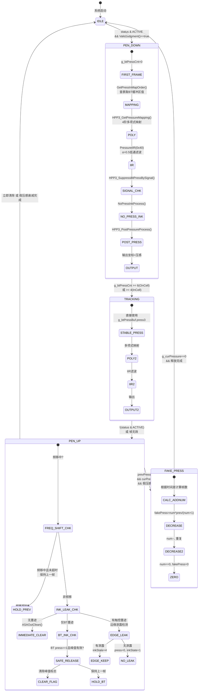

# Goodix HPP3 快速落笔/抬笔算法伪代码还原

## 1. 全局状态定义

```c
// ==================== 帧状态位域 ====================
#define STATUS_HPP2          0x01    // HPP2协议
#define STATUS_HPP3          0x02    // HPP3协议
#define STATUS_FREQ_SKIP     0x04    // 频移跳过帧
#define STATUS_MODE_BIT      0x08    // 模式位
#define STATUS_ACTIVE        0x10    // 笔在范围内(Active Stylus)
#define STATUS_TP_FREQ_SHIFT 0x20    // TP频移进行中
#define STATUS_BT_FREQ_DONE  0x40    // BT频移完成
#define STATUS_BT_FREQ_REQ   0x80    // BT频移请求

// ==================== inRange状态位域 ====================
#define INRANGE_BIT0         0x01    // TX1/TX2峰值有效(在范围内)
#define INRANGE_BT_PRESS     0x02    // BT压感有效
#define INRANGE_HAS_PRESS    0x04    // 压感值非零(有墨)
#define INRANGE_BIT3         0x08    // (保留)

// ==================== 墨迹输出状态 ====================
#define INK_STATE_NONE       0       // 无墨迹
#define INK_STATE_HAS_INK    1       // 有墨迹(正常)
#define INK_STATE_EDGE_KEEP  4       // 边缘保持墨迹

// ==================== 压感映射模式 ====================
#define PRESS_MAP_DEFAULT    0       // 直接使用BT原始值
#define PRESS_MAP_ONCELL     1       // OnCell查表模式(前6帧)
#define PRESS_MAP_INCELL     2       // InCell查表模式(前4帧)

// ==================== BT压感环形缓冲区 ====================
// 4个u16采样值，由固件从蓝牙协议包解析填充
struct BtPressureBuffer {
    u16 press0;   // offset +0, bt_press1
    u16 press1;   // offset +2, bt_press2
    u16 press2;   // offset +4, bt_press3
    u16 press3;   // offset +6, bt_press4 (当前帧最终压感)
};

// ==================== 查表映射索引 ====================
// g_btPressMapOncell[6]: OnCell模式前6帧的缓冲区索引
// g_btPressMapIncell[4]: InCell模式前4帧的缓冲区索引
// 典型值推测: {3,3,3,2,2,1} 或 {3,2,1,0} (从最新采样逐步回退)
extern u8 g_btPressMapOncell[6];
extern u8 g_btPressMapIncell[4];

// ==================== 核心全局变量 ====================
BtPressureBuffer g_btPressBuf;       // BT压感缓冲区
u32  g_curStatus;                    // 当前帧status
u32  g_prevStatus;                   // 前帧status
u8   g_inRange;                      // 在范围内标志(位域)
u8   g_prevInRange;                  // 前帧在范围内标志
u8   g_btPressValid;                 // BT压感有效标志
u8   g_noPressInkFlag;               // 无墨/触控标志
u8   g_noPressInkEnterDebounce;      // 进入无墨防抖计数
u8   g_noPressInkExitDebounce;       // 退出无墨防抖计数
u16  g_noPressInkEnterThold_X;       // 进入阈值-X轴(DAT_1823196e, 用enterPct)
u16  g_noPressInkEnterThold_Y;       // 进入阈值-Y轴(DAT_1823196a, 用enterPct)
u16  g_noPressInkExitThold_X;        // 退出阈值-X轴(DAT_1823196c, 用exitPct)
u16  g_noPressInkExitThold_Y;        // 退出阈值-Y轴(DAT_18231968, 用exitPct)
u16  g_curPressure;                  // 当前帧压感值(映射后)
u16  g_prevPressure;                 // 前帧压感值(映射后)
u8   g_inkOutputState;               // 墨迹输出状态
u8   g_inkSubState;                  // 墨迹子状态(bit0/1/2)
u8   g_btPressCnt;                   // BT压感帧计数器
u8   g_isLastFrameBypass;            // 上一帧是否旁路
u8   g_freqShift;                    // 频移状态位掩码
u8   g_flagTX2NotNull;               // TX2数据是否存在
u8   g_flagDataType;                 // 数据类型(强制=2 Grid)
u8   g_flagHPP3Protocol;             // HPP3协议标志
u8   g_hpp3ExitFlag;                 // 信号过低退出标志
u8   g_disablePressEdgeSignalIsTooLow; // 边缘信号过低禁压标志
u8   g_fakePressureDecreaseAdded;    // 假压感已初始化
u8   g_fakePressureDecreaseAddNum;   // 假压感衰减剩余帧数
u16  g_tx1Signal;                    // TX1信号强度(综合, DAT_18231164)
u16  g_tx2Signal;                    // TX2信号强度(综合, DAT_1823116a)
u16  g_tx1Signal_X;                  // TX1 X轴峰值信号(DAT_18231160)
u16  g_tx1Signal_Y;                  // TX1 Y轴峰值信号(DAT_18231162)
u8   g_gridTx1Valid;                 // TX1 Grid峰值有效
u8   g_gridTx2Valid;                 // TX2 Grid峰值有效
u8   g_gridTx1PeakValid;             // TX1峰值有效(主峰)
u8   g_gridTx2PeakValid;             // TX2峰值有效(主峰)
u64  g_timestamp;                    // 当前帧时间戳(ms)
u8   g_stylusRecheckFlag;            // 触笔重检标志
u8   g_flagTX2Start;                 // TX2已启动标志
u16  g_edgeCoorX;                    // 边缘坐标X
u16  g_edgeCoorY;                    // 边缘坐标Y
u16  g_edgePrevCoorX;               // 边缘前帧坐标X
u16  g_edgePrevCoorY;               // 边缘前帧坐标Y
u8   g_signalAbnormal;               // 信号异常标志(位域)
ASOut g_curASOut;                    // 当前输出(0xEC字节)
ASOut g_prevASOut;                   // 前帧输出(0xEC字节)
```

---

## 2. ASA_MainProcess — 主状态机

```c
int ASA_MainProcess(TsaAfeFrame *frame) {
    TsaStylusFrame *stylus = frame->stylus;

    // ---- 步骤1: 时间戳记录 ----
    g_timestamp = (u64)frame->timestampSec * 1000
                + (u64)(frame->timestampUsec / 1000);

    // ---- 步骤2: 频移预处理(仅HPP3) ----
    g_curStatus = stylus->status;
    if (g_curStatus & STATUS_HPP3) {
        HPP3_FreqShiftProcess(stylus);
    }

    // ---- 步骤3: 帧有效性判定 ----
    if (!ValidJudgment(stylus)) {
        // 无效帧 → 检查是否需要保持上一帧(频移中)
        if (ReleaseASAReportInFreqShifting()) {
            return 3;  // 频移中,保持上一帧输出
        }
        ASA_Reset();    // 完全无效,重置所有状态
        return 1;
    }

    // ---- 步骤4: 检测"退出触笔模式" ----
    // 前帧有Active标志,但当前帧没有 → 笔离开屏幕
    if ((g_prevStatus & STATUS_ACTIVE) && !(g_curStatus & STATUS_ACTIVE)) {
        char released = ReleaseASAReportExitStylus();
        if (released) {
            g_prevStatus = g_curStatus;
        }
        g_isLastFrameBypass = 1;
        return 3;  // 过渡帧,保持输出
    }

    // ---- 步骤5: 频移跳过帧处理 ----
    if (g_curStatus & STATUS_FREQ_SKIP) {
        ReleaseASAReportInFreqShifting();
        g_isLastFrameBypass = 1;
        return 3;
    }

    // ---- 步骤6: 正常处理路径 ----
    ASAStaticStatusPreProcess(g_curStatus);
    g_prevStatus = g_curStatus;
    ASAPropertyPreProcess();   // memset(g_asaPrpt, 0, 0x7AC)
    ASAStaticPreProcess();     // g_inRange = 0
    ASAOutClean();             // memset(g_curASOut, 0, 0xEC)

    // ---- 步骤7: 协议分支 ----
    if (g_curStatus & STATUS_HPP3) {
        // *** HPP3 路径 ***
        HPP3_UpdataStylus2Buf(stylus);
        int ret = HPP3_DataProcess();
        if (ret != 0) {
            ReleaseASAReportInFreqShifting();
            g_isLastFrameBypass = 1;
            return 3;
        }
    } else if (g_curStatus & STATUS_HPP2) {
        // *** HPP2 路径 ***
        HPP2_UpdataStylus2Buf(stylus);
        int ret = HPP2_DataProcess();
        if (ret != 0) {
            g_isLastFrameBypass = 1;
            return 3;
        }
    }

    // ---- 步骤8: 坐标后处理 ----
    ASA_CoorPostProcess();
    g_stylusRecheckFlag = StylusRecheck_EnterStylusMode();
    AnimationProcess();
    ReleaseASAReportInFreqShifting();

    // ---- 步骤9: 提交输出 ----
    memcpy(&g_prevASOut, &g_curASOut, 0xEC);
    g_isLastFrameBypass = 0;
    ASACalibration_Process();
    return 0;
}
```

---

## 3. 快速落笔算法 (Pen Down)

### 3.1 核心思路

HPP3蓝牙笔通过2.4G链路传输压感数据,但蓝牙帧和触摸帧存在时序差。快速落笔的核心问题是: **首帧触摸数据到达时,BT压感数据可能尚未就绪或仅部分有效**。

解决方案: 使用**4级BT压感缓冲区** + **查表映射**,在前几帧从缓冲区中选择最可靠的历史压感采样值,而非直接使用当前帧的BT值。

### 3.2 HPP3_UpdataStylus2Buf — 数据缓冲区填充

```c
void HPP3_UpdataStylus2Buf(TsaStylusFrame *frame) {
    g_flagTX2NotNull = (frame->tx2Data != NULL);
    g_flagDataType   = 2;  // 强制Grid模式

    // 将9×9 TX1/TX2 Grid数据拷贝到工作缓冲区
    HPP3_UpdateStylus2BufNormalGrid(frame);

    g_flagHPP3Protocol = 1;
    g_pressBuf      = 0;            // BT压感缓冲区指针(未使用此字段)
    g_buttonBuf     = 0;
    g_mainFreqBuf   = frame->tx1Freq;
    g_auxiFreqBuf   = frame->tx2Freq;
}
```

### 3.3 HPP3_PressureProcess — 压感解算(落笔核心)

```c
void HPP3_PressureProcess(void) {
    g_btPressValid = 0;

    // ===== 关键判断: BT压感最终值是否非零 =====
    if (g_btPressBuf.press3 == 0) {
        // BT报告无压感 → 输出0
        g_curPressure = 0;
        local_btMapped = 0;
    } else {
        // ===== 步骤A: 查表获取映射前压感 =====
        local_btMapped = GetPressInMapOrder();

        // ===== 步骤B: 多项式映射 =====
        g_curPressure = HPP3_GetPressureMapping(local_btMapped);

        // ===== 步骤C: IIR低通滤波(仅当前后帧都有压感时) =====
        if (g_curPressure != 0 && g_prevPressure != 0) {
            PressureIIR(0x40);  // α = 0.5
        }
    }

    // ===== 步骤D: 帧计数器递增(落笔关键!) =====
    g_btPressCnt++;

    // ===== 步骤E: 信号过低抑制 =====
    HPP3_SuppressBtPressBySignal();

    // ===== 步骤F: 设置压感有效标志 =====
    if (g_curPressure != 0) {
        g_btPressValid = 1;
    }
}
```

### 3.4 GetPressInMapOrder — 落笔首帧查表映射

```c
u16 GetPressInMapOrder(void) {
    u8 mapMode = g_asaPrmtFlash[0xA30];  // 映射模式

    if (mapMode == PRESS_MAP_ONCELL) {
        // OnCell模式: 前6帧使用查表索引
        if (g_btPressCnt < 6 && g_btPressBuf.press0 != 0) {
            // 从缓冲区中按查表索引取值
            u8 idx = g_btPressMapOncell[g_btPressCnt];
            return ((u16*)&g_btPressBuf)[idx];
        } else {
            // 超过6帧或缓冲区为空 → 使用最终值
            return g_btPressBuf.press3;
        }
    }
    else if (mapMode == PRESS_MAP_INCELL) {
        // InCell模式: 前4帧使用查表索引
        if (g_btPressCnt < 4 && g_btPressBuf.press0 != 0) {
            u8 idx = g_btPressMapIncell[g_btPressCnt];
            return ((u16*)&g_btPressBuf)[idx];
        } else {
            return g_btPressBuf.press3;
        }
    }
    else {
        // 默认模式: 直接使用BT最终压感
        return g_btPressBuf.press3;
    }
}
```

**落笔时序示意**:

```
帧序号:    0     1     2     3     4     5     6    ...
g_btPressCnt: 0  →  1  →  2  →  3  →  4  →  5  →  6  → ...

OnCell查表:
  帧0: buf[g_btPressMapOncell[0]]  (如 buf[3] = 最新采样)
  帧1: buf[g_btPressMapOncell[1]]  (如 buf[3] 或 buf[2])
  帧2: buf[g_btPressMapOncell[2]]  (逐步稳定)
  ...
  帧6+: 直接使用 buf.press3

InCell查表:
  帧0: buf[g_btPressMapIncell[0]]
  帧1: buf[g_btPressMapIncell[1]]
  帧2: buf[g_btPressMapIncell[2]]
  帧3: buf[g_btPressMapIncell[3]]
  帧4+: 直接使用 buf.press3
```

### 3.5 HPP3_GetPressureMapping — 多项式映射

```c
u16 HPP3_GetPressureMapping(u16 rawPressure) {
    // 根据硬件版本选择参数组索引
    u8 paramIdx;
    if (g_curStylusHWVersion == 1 || g_curStylusHWVersion == 2) {
        paramIdx = g_asaPrmtFlash[0xA81];
    } else {
        paramIdx = g_asaPrmtFlash[0xA80];
    }

    // 映射参数表基址: DAT_18115f82 + paramIdx * 0x58
    // 每组0x58=88字节: 3个阈值(u16) + 5组多项式系数(double*5+double*5+...)
    PressureMapParams *params = &g_pressMapTable[paramIdx];

    if (rawPressure == 0xFFF) return 0xFFF;  // 最大值直通

    u16 result;

    if (rawPressure > params->threshold3) {
        // 高压段: 4阶多项式
        double x = (double)rawPressure;
        result = (u16)(params->high.a0
                      + params->high.a1 * x
                      + params->high.a2 * x * x
                      + params->high.a3 * x * x * x
                      + params->high.a4 * x * x * x * x);
    }
    else if (rawPressure > params->threshold1) {
        // 中压段: 4阶多项式(不同系数)
        double x = (double)rawPressure;
        result = (u16)(params->mid.a0
                      + params->mid.a1 * x
                      + params->mid.a2 * x * x
                      + params->mid.a3 * x * x * x
                      + params->mid.a4 * x * x * x * x);
    }
    else {
        // 低压段: 直通,最小值=1
        result = rawPressure;
        if (result > 1) result = 1;
    }

    // 限幅
    if (result > 0xFFF) result = 0xFFF;
    return result;
}
```

### 3.6 PressureIIR — IIR低通滤波

```c
void PressureIIR(u8 alpha_raw) {
    u8 alpha = alpha_raw;
    if ((s8)alpha_raw < 0) alpha = 0x7F;  // 限幅到127

    // 一阶IIR: y[n] = (1-α)*y[n-1] + α*x[n]
    // α = alpha/128, 此处 alpha=0x40 → α=0.5
    int result = (u32)g_prevPressure * (0x80 - alpha)
              + (u32)g_curPressure * alpha;

    // 四舍五入
    if (result < 0) result += 0x7F;
    g_curPressure = (s16)(result >> 7);
}
```

### 3.7 HPP3_SuppressBtPressBySignal — 信号过低抑制

```c
void HPP3_SuppressBtPressBySignal(void) {
    // 压感为0时清除退出标志
    if (g_curPressure == 0) {
        g_hpp3ExitFlag = 0;
    }

    u16 sigLowThreshold  = *(u16*)(g_asaPrmtStylus + 0x24C);
    u16 sigHighThreshold = *(u16*)(g_asaPrmtStylus + 0x24E);

    if (g_hpp3ExitFlag == 0) {
        // 信号低于下限阈值 && 无TX2/TX1峰值 → 抑制
        if (g_tx1Signal < sigLowThreshold
            && !g_gridTx2PeakValid
            && !g_gridTx1PeakValid) {
            g_hpp3ExitFlag = 1;
            g_curPressure  = 0;
            g_btPressValid = 0;
        }
    }
    else if (g_hpp3ExitFlag == 1) {
        // 信号恢复需超过上限阈值(滞后)
        if (g_tx1Signal >= sigHighThreshold) {
            g_hpp3ExitFlag = 0;   // 恢复
        } else {
            g_curPressure  = 0;   // 仍过低
            g_btPressValid = 0;
        }
    }
}
```

### 3.8 ASAStaticStatusProcess — 在范围内判定

```c
void ASAStaticStatusProcess(void) {
    // 两个峰值都有效才认为"在范围内"
    if (!g_gridTx2PeakValid || !g_gridTx1PeakValid) {
        ExitInRangeMode();
    } else {
        g_inRange |= INRANGE_BIT0;  // 在范围内
    }

    if (g_inRange & INRANGE_BIT0) {
        EnterInRangeMode();
    }
}
```

### 3.9 HPP3_ASAStaticStatusPostProcess — 最终墨迹状态构建

```c
void HPP3_ASAStaticStatusPostProcess(void) {
    // bit1: BT压感有效 → 有墨
    if (g_btPressValid != 0) {
        g_inRange |= INRANGE_BT_PRESS;
    }
    // bit2: 压感值非零 → 有压感(可来自NoPressInk)
    if (g_curPressure != 0) {
        g_inRange |= INRANGE_HAS_PRESS;
    }

    // 根据最终状态进入/退出模式
    if (g_inRange & INRANGE_HAS_PRESS) {
        EnterNoPressInkMode();   // 有压感(可能是触控)
    }
    if (!(g_inRange & INRANGE_HAS_PRESS)) {
        ExitNoPressInkMode();
    }
    if (g_inRange & INRANGE_BT_PRESS) {
        EnterInkMode();          // BT压感有效 → 进入墨迹模式
    }
    if (!(g_inRange & INRANGE_BT_PRESS)) {
        ExitInkMode();
    }
}
```

### 3.10 快速落笔完整时序

```
时刻T0: 笔接触屏幕
  ├─ 触摸IC检测到9×9 TX1/TX2信号变化
  ├─ 构造TsaStylusFrame, status |= STATUS_ACTIVE | STATUS_HPP3
  ├─ BT固件开始通过2.4G发送压感数据
  └─ BT压感缓冲区 g_btPressBuf 开始填充

帧0 (g_btPressCnt=0):
  ├─ EnterActiveStylusMode()
  │   ├─ g_inRange = 0
  │   ├─ g_stylusRecheckFlag = 1
  │   └─ 计数器初始化
  ├─ HPP3_UpdataStylus2Buf() → g_flagDataType=2, 拷贝9×9 Grid
  ├─ GetGridTx1Peaks() → 峰值搜索, g_tx1Signal获取
  ├─ TX1CoordinateProcess() → 坐标解算
  ├─ HPP3_PressureProcess():
  │   ├─ g_btPressBuf.press3 != 0? (BT数据可能仅部分到达)
  │   ├─ GetPressInMapOrder(): OnCell→ buf[g_btPressMapOncell[0]]
  │   ├─ HPP3_GetPressureMapping() → 多项式映射
  │   └─ g_btPressCnt++ → 1
  ├─ HPP3_SuppressBtPressBySignal() → 信号检查
  ├─ NoPressInkProcess() → 判断是否无墨触控
  ├─ HPP3_PostPressureProcess() → 后处理
  └─ g_inkOutputState = g_inRange → 输出首帧

帧1~5 (OnCell) / 帧1~3 (InCell):
  ├─ g_btPressCnt 递增
  ├─ GetPressInMapOrder(): 按查表索引从缓冲区取值
  │   逐步从"最可靠的采样"过渡到"当前帧最终值"
  └─ 压感逐渐稳定, IIR滤波开始生效

帧6+ (OnCell) / 帧4+ (InCell):
  ├─ GetPressInMapOrder(): 直接使用 g_btPressBuf.press3
  └─ 压感完全稳定, 进入正常追踪模式
```

---

## 4. 快速抬笔算法 (Pen Up)

### 4.1 核心思路

抬笔时有三个关键问题:
1. **墨迹泄露(Ink Leakage)**: 笔离开瞬间,BT压感可能仍非零,需避免残留墨点
2. **频移过渡**: 笔离开后TP/BT频率可能还在切换中,需保持输出
3. **边缘处理**: 笔从屏幕边缘离开时,需特殊处理坐标

### 4.2 ReleaseASAReportExitStylus — 抬笔核心

```c
char ReleaseASAReportExitStylus(void) {
    char releaseDone = 0;

    // ---- 第一优先: 频移中不释放 ----
    if (ReleaseASAReportInFreqShifting()) {
        return 1;  // 频移中,保持上一帧,不真正释放
    }

    // ---- 第二优先: 检查墨迹子状态 ----
    // g_inkSubState 的 bit1(bit2) 表示有来自NoPressInk的触控墨迹
    if (!(g_inkSubState & 0x06)) {
        // ===== 无触控墨迹 =====
        if (!(g_inkSubState & 0x01)) {
            // --- 完全无墨: 立即清除 ---
            ASAOutClean();
            ASAStaticCounterClean();
            releaseDone = 1;
        }
        else {
            // --- 仅有BT墨迹(bit0): 保持上一帧,检查泄露 ---
            memcpy(&g_curASOut, &g_prevASOut, 0xEC);
            g_inkOutputState = INK_STATE_HAS_INK;

            // 泄露检测: DAT_18231b1c==1 且 DAT_18231b24==1 时认为可能是泄露
            // (DAT_18231b1c/DAT_18231b24为内部状态位,非直接的BT压感或峰值标志)
            if (DAT_18231b1c == 1 && DAT_18231b24 == 1) {
                // 可能是泄露,清除标志
                DAT_18231b24 = 0;
            } else {
                // 真正释放
                ASAOutClean();
                ASAStaticCounterClean();
                releaseDone = 1;
            }
        }
    }
    else {
        // ===== 有触控墨迹(NoPressInk) =====
        memcpy(&g_curASOut, &g_prevASOut, 0xEC);

        // 边缘墨迹泄露检测
        char edgeLeakage = EdgeCoorProcessExitStylusWithInk();
        if (!edgeLeakage) {
            g_inkOutputState = INK_STATE_HAS_INK;
            g_curPressure = 0;  // 压感清零但保持坐标
        } else {
            g_inkOutputState = INK_STATE_EDGE_KEEP;  // 边缘保持
        }
    }

    // ---- 清理TX2状态 ----
    g_flagTX2Start = 0;

    // ---- 保存输出快照 ----
    memcpy(&g_prevASOut, &g_curASOut, 0xEC);

    return releaseDone;
}
```

### 4.3 EdgeCoorProcessExitStylusWithInk — 边缘泄露检测

```c
// 检查抬笔时坐标是否在屏幕边缘且有大幅跳变
// 返回: 1=有边缘泄露(需保持), 0=无泄露
char EdgeCoorProcessExitStylusWithInk(void) {
    bool isEdgeX = false;
    bool isEdgeY = false;

    // ---- X方向边缘判定 ----
    // 左边缘: 坐标 < 0x400 且 在远离边缘方向移动
    if (g_edgeCoorX < 0x400 && g_edgeCoorX < g_edgePrevCoorX) {
        isEdgeX = true;
    }
    // 右边缘: 坐标 > (gridCols-1)*0x400 且 在远离边缘方向移动
    if (g_edgeCoorX > (g_gridCols - 1) * 0x400
        && g_edgePrevCoorX < g_edgeCoorX) {
        isEdgeX = true;
    }

    // X方向位移差
    u16 diffX = abs((s16)g_edgeCoorX - (s16)g_edgePrevCoorX);

    // ---- X边缘+大位移 → 边缘泄露 ----
    if (isEdgeX && diffX > 0x200) {
        g_outCoorX = g_edgeCoorX;  // 使用边缘坐标
        g_outCoorY = g_edgeCoorY;
        return 1;  // 检测到泄露
    }

    // ---- Y方向边缘判定(同理) ----
    if (g_edgeCoorY < 0x400 && g_edgeCoorY < g_edgePrevCoorY) {
        isEdgeY = true;
    }
    if (g_edgeCoorY > (g_gridRows - 1) * 0x400
        && g_edgePrevCoorY < g_edgeCoorY) {
        isEdgeY = true;
    }

    u16 diffY = abs((s16)g_edgeCoorY - (s16)g_edgePrevCoorY);

    if (isEdgeY && diffY > 0x200) {
        g_outCoorX = g_edgeCoorX;
        g_outCoorY = g_edgeCoorY;
        return 1;
    }

    return 0;  // 无边缘泄露
}
```

### 4.4 ReleaseASAReportInFreqShifting — 频移中保持

```c
// 频移期间保持上一帧输出
int ReleaseASAReportInFreqShifting(void) {
    if (!NeedASAReportInFreqShifting()) {
        return 0;  // 不需要保持
    }
    // 保持上一帧输出
    memcpy(&g_curASOut, &g_prevASOut, 0xEC);
    return 1;
}
```

### 4.5 NeedASAReportInFreqShifting — 频移保持条件判定

```c
int NeedASAReportInFreqShifting(void) {
    // ---- 条件1: BT笔正在频移中 ----
    char inFreqShift = HPP3_BtPenInFreqShifting();
    if (inFreqShift) {
        // 频移中,但检查防抖超时
        char debounceTimeout = HPP3_BtPenFreqShiftingDebounceTimeOut();
        if (!debounceTimeout) {
            // 频移中且未超时 → 需要保持
            goto check_report;
        }
    }

    // ---- 条件2: 有触控墨迹且噪声防抖 ----
    if ((g_inkSubState & 0x06) && HPP3_NeedNoiseDebounce()) {
        goto check_report;
    }

    return 0;  // 不需要保持

check_report:
    // ---- 进一步检查是否可上报 ----
    char hasInk = ASA_GetRptInk();  // g_inkSubState & 0x06

    // 如果无墨迹 或 重检被禁 或 噪声防抖中 → 禁止重检
    if ((!hasInk || g_forceDisableRecheck || !g_stylusRecheckFlag)
        && (g_inkSubState & 0x06)) {
        g_stylusRecheckDisable = 1;
    }

    // 范围状态变化 → 保持
    if (!g_prevInRange && g_inRange) {
        g_prevInRange = g_inRange;
        return 1;
    }

    // 退出Active模式 → 保持
    if ((g_prevStatus & STATUS_ACTIVE) && !(g_curStatus & STATUS_ACTIVE)) {
        g_curStatus = g_prevStatus;
        return 1;
    }

    // 无墨迹且有触控 → 保持
    hasInk = ASA_GetRptInk();
    if (!hasInk && (g_inkSubState & 0x06)) {
        return 1;
    }

    return 0;
}
```

### 4.6 HPP3_BtPenInFreqShifting — BT频移状态判定

```c
int HPP3_BtPenInFreqShifting(void) {
    // 条件1: BT已连接且正在频移
    if (g_btEnabled && g_freqShift != 0) {
        return 1;
    }
    // 条件2: 当前时间早于BT频移完成时间(时钟回绕保护)
    if (g_timestamp < g_btFreqShiftDoneTimestamp) {
        return 1;
    }
    return 0;
}
```

### 4.7 HPP3_BtPenFreqShiftingDebounceTimeOut — 频移防抖

```c
int HPP3_BtPenFreqShiftingDebounceTimeOut(void) {
    u64 now = GetRealtime();
    u64 btShiftStart = g_btFreqShiftStartTimestamp;

    // 两种参数模式
    if (g_asaPrmtStylus[0x26E] != 0) {
        // 模式A: BT频移完成后150ms超时
        if (now <= btShiftStart + 0x96) return 0;
    } else {
        // 模式B: BT频移完成后50ms超时
        if (now <= btShiftStart + 0x32) return 0;
    }

    // 额外: 当前时间戳距BT频移开始50ms以上
    if (g_timestamp <= btShiftStart + 0x32) return 0;

    return 1;  // 超时
}
```

### 4.8 HPP3_PostPressureProcess — 抬笔后压感衰减(无BT信号时)

```c
void HPP3_PostPressureProcess(void) {
    // ---- 场景1: NoPressInk生效但无BT压感 → 默认/继承压感 ----
    if (!g_btPressValid && g_noPressInkFlag) {
        // 先赋予默认防断线伪压感
        g_curPressure = 10;
        // 如果上一帧有历史压感,则覆盖为前帧值(保证笔迹连贯)
        if (g_prevPressure != 0) {
            g_curPressure = g_prevPressure;
        }
    }

    // ---- 场景2: 频移中 → 重置假压感 ----
    char inFreqShift = HPP3_BtPenInFreqShifting();
    if (inFreqShift) {
        char timeout = HPP3_BtPenFreqShiftingDebounceTimeOut();
        if (!timeout) {
            // 频移中且未超时 → 重置假压感衰减
            g_disablePressEdgeSignalIsTooLow = 0;
            g_fakePressureDecreaseAdded = 0;
            g_fakePressureDecreaseAddNum = 0;
            return;
        }
    }

    // ---- 场景3: 假压感衰减(笔离开但仍有残余墨迹) ----
    if (g_asaPrmtFlash[0xA74] != 0     // 假压感使能
        && g_prevPressure > 500         // 前帧有较大压感
        && g_curPressure < 11)          // 当前帧压感极小
    {
        g_curPressure = HPP3_FakePressureDecreaseProcess();
    }

    // ---- 场景4: 压感为0 → 重置所有假压感状态 ----
    if (g_curPressure == 0) {
        g_disablePressEdgeSignalIsTooLow = 0;
        g_fakePressureDecreaseAdded = 0;
        g_fakePressureDecreaseAddNum = 0;
        return;
    }

    // ---- 场景5: 边缘信号过低检测 ----
    u16 edgeThreshold = *(u16*)(g_asaPrmtStylus + 0x232);

    if (g_disablePressEdgeSignalIsTooLow == 0) {
        // 检测边缘信号是否过低
        bool tx1Low = false, tx2Low = false;

        if (!g_gridTx1PeakValid || !g_gridTx2PeakValid) {
            // 单峰: 信号 < 阈值
            if (g_gridTx1PeakValid && g_tx1Signal < edgeThreshold) tx1Low = true;
            if (g_gridTx2PeakValid && g_tx2Signal < edgeThreshold) tx2Low = true;
        } else {
            // 双峰: 信号 < 2/3阈值
            if (g_tx1Signal < (edgeThreshold * 2) / 3) tx1Low = true;
            if (g_tx2Signal < (edgeThreshold * 2) / 3) tx2Low = true;
        }

        if (tx1Low || tx2Low) {
            g_disablePressEdgeSignalIsTooLow = 1;
        }
    }

    // 恢复条件: 信号超过恢复阈值
    if (g_disablePressEdgeSignalIsTooLow == 1) {
        u16 recoveryThreshold = *(u16*)(g_asaPrmtStylus + 0x236);
        bool recovered = true;

        if (g_gridTx1PeakValid && g_tx1Signal < recoveryThreshold) recovered = false;
        if (g_gridTx2PeakValid && g_tx2Signal < recoveryThreshold) recovered = false;

        if (recovered) {
            g_disablePressEdgeSignalIsTooLow = 0;
        }
    }

    // 边缘信号过低 → 清零压感
    if (g_disablePressEdgeSignalIsTooLow == 1) {
        g_curPressure  = 0;
        g_btPressValid = 0;
    }
}
```

### 4.9 HPP3_FakePressureDecreaseProcess — 假压感衰减

```c
u16 HPP3_FakePressureDecreaseProcess(void) {
    u16 fakePressure = 0;

    // ---- 首次调用: 根据时间差计算衰减帧数 ----
    if (!g_fakePressureDecreaseAdded && g_fakePressureDecreaseAddNum == 0) {
        u32 timeDiff = g_timeDiffSincePenUp;  // DAT_1820dc38

        if      (timeDiff < 100)  g_fakePressureDecreaseAddNum = 0;
        else if (timeDiff < 0x12d) g_fakePressureDecreaseAddNum = 1;  // < 301
        else if (timeDiff < 0x1f5) g_fakePressureDecreaseAddNum = 2;  // < 501
        else                       g_fakePressureDecreaseAddNum = 3;  // >= 501

        g_fakePressureDecreaseAdded = 1;
    }

    // ---- 计算假压感值 ----
    if (g_fakePressureDecreaseAddNum != 0) {
        // 衰减公式: fakePress = (num * prevPress) / (num + 1)
        fakePressure = (u16)(
            ((u32)g_fakePressureDecreaseAddNum * (u32)g_prevPressure)
            / (u32)(g_fakePressureDecreaseAddNum + 1)
        );
        g_fakePressureDecreaseAddNum--;
    }

    return fakePressure;
}
```

**衰减时序表**:

| 抬笔后时间差 | AddNum | 帧1 | 帧2 | 帧3 | 帧4 |
|-------------|--------|-----|-----|-----|-----|
| < 100ms | 0 | 0 | - | - | - |
| 101~300ms | 1 | prev/2 | 0 | - | - |
| 301~500ms | 2 | 2prev/3 | prev/2 | 0 | - |
| > 500ms | 3 | 3prev/4 | 2prev/3 | prev/2 | 0 |

### 4.10 NoPressInkHandle — 无墨触控判定(影响抬笔延迟)

```c
void NoPressInkHandle(void) {
    // ---- 信号缓冲与异常检测 ----
    BuffTX1And2SignalAndPos();      // 20帧滑动窗口
    CheckSignalAbnormalStatus();    // 信号跳变/手掌耦合/倾斜偏移

    // ---- 倾斜学习检查 ----
    if (!ASA_IsHpp3NoPressTLearnedFeatureEnabled()
        || IsTiltLearnedOK()) {

        // ---- 倾斜补偿 ----
        if (g_flagTX2NotNull) {
            g_noPressInkTiltCompensation = GetNoPressInkTiltCompensation();
        }

        // ---- 更新阈值 ----
        UpdateNoPressInkThold();

        // ===== 进入无墨判定 =====
        if (!EnterToNoPressInk()) {
            // 未进入无墨 → 设置退出防抖
            if (!g_noPressInkFlag) {
                g_noPressInkEnterDebounce = 2;
            }
        } else {
            // 进入无墨 → 退出防抖递减
            if (g_noPressInkEnterDebounce > 0) {
                g_noPressInkEnterDebounce--;
            }
            if (g_noPressInkEnterDebounce == 0) {
                g_noPressInkFlag = 1;       // 确认进入无墨
                g_noPressInkExitDebounce = 2;
            }
        }

        // ===== 退出无墨判定 =====
        if (!ExitToNoPressInk()) {
            if (g_noPressInkFlag) {
                g_noPressInkExitDebounce = 2;
            }
        } else {
            if (g_noPressInkExitDebounce > 0) {
                g_noPressInkExitDebounce--;
            }
            if (g_noPressInkExitDebounce == 0) {
                g_noPressInkFlag = 0;       // 确认退出无墨
                g_noPressInkEnterDebounce = 2;
            }
        }

        // ---- 坐标修正与TX2启动互斥 ----
        if (ASA_IsHpp3CoorReiviseFeatureEnabled()
            && !g_flagTX2Start) {
            g_noPressInkFlag = 0;  // TX2未启动时强制退出无墨
        }
    }
    else {
        // 倾斜未学习 → 禁用无墨
        g_noPressInkFlag = 0;
    }
}
```

### 4.11 EnterToNoPressInk / ExitToNoPressInk — 无墨阈值判定

```c
// 进入无墨条件: 信号高于进入阈值(落笔时信号增强)
int EnterToNoPressInk(void) {
    if (g_asaPrmtFlash[0xA50] == 0) {
        // 默认模式: TX1综合信号 vs 进出阈值均值
        // enterTholdAvg = (g_noPressInkEnterThold_X >> 1) + (g_noPressInkEnterThold_Y >> 1)
        u16 enterThresholdAvg = (g_noPressInkEnterThold_X >> 1)
                              + (g_noPressInkEnterThold_Y >> 1);
        return (enterThresholdAvg < g_tx1Signal) ? 1 : 0;
    } else {
        // 分离模式: TX1的X轴和Y轴信号分别与对应阈值比较
        return (g_noPressInkEnterThold_Y < g_tx1Signal_Y
             && g_noPressInkEnterThold_X < g_tx1Signal_X) ? 1 : 0;
    }
}

// 退出无墨条件: 信号低于退出阈值(抬笔时信号减弱, 滞后)
int ExitToNoPressInk(void) {
    if (g_asaPrmtFlash[0xA50] == 0) {
        // 默认模式: TX1综合信号 vs 退出阈值均值
        u16 exitThresholdAvg = (g_noPressInkExitThold_Y >> 1)
                             + (g_noPressInkExitThold_X >> 1);
        return (g_tx1Signal < exitThresholdAvg) ? 1 : 0;
    } else {
        // 分离模式: TX1的X轴和Y轴信号分别低于对应退出阈值
        return (g_tx1Signal_Y < g_noPressInkExitThold_Y
             && g_tx1Signal_X < g_noPressInkExitThold_X) ? 1 : 0;
    }
}
```

### 4.12 UpdateNoPressInkThold — 自适应阈值更新

```c
void UpdateNoPressInkThold(void) {
    // 从学习表获取基础阈值
    u16 baseThold = GetNopressInkTholdFromLearnedTable(
        g_outCoorX & 0xFFFF, g_outCoorY & 0xFFFF);

    u16 compensation = baseThold + g_noPressInkTiltCompensation;

    // asaPrmtStylus+0x244: 进入阈值百分比 (enterPct)
    // asaPrmtStylus+0x245: 退出阈值百分比 (exitPct)
    // 注: X轴和Y轴的同组阈值数值相同(统一由compensation*百分比/100生成)
    u8  enterPct = g_asaPrmtStylus[0x244];
    u8  exitPct  = g_asaPrmtStylus[0x245];

    // 落笔阈值: X轴和Y轴均使用enterPct
    g_noPressInkEnterThold_X = (u16)((compensation * enterPct) / 100);
    g_noPressInkEnterThold_Y = (u16)((compensation * enterPct) / 100);
    // 抬笔阈值: X轴和Y轴均使用exitPct
    g_noPressInkExitThold_X  = (u16)((compensation * exitPct)  / 100);
    g_noPressInkExitThold_Y  = (u16)((compensation * exitPct)  / 100);
}
```

### 4.13 GetNoPressInkTiltCompensation — 倾斜补偿量

```c
u16 GetNoPressInkTiltCompensation(void) {
    u16 tx2Signal = g_tx2Signal;

    // 限幅: TX2信号不超过参数上限
    u16 tx2Max = *(u16*)(g_asaPrmtStylus + 0x248);
    if (tx2Max < tx2Signal) tx2Signal = tx2Max;

    // 减去下限
    u16 tx2Min = *(u16*)(g_asaPrmtStylus + 0x246);
    if (tx2Signal < tx2Min) {
        tx2Signal = 0;
    } else {
        tx2Signal -= tx2Min;
    }

    // 补偿量 = 斜率参数 * (TX2信号 - 下限) / 100
    return (u16)((u32)g_tiltCompSlope * (u32)tx2Signal / 100);
}
```

### 4.14 HPP3_InkLeakageJudge — 墨迹泄露判定

```c
void HPP3_InkLeakageJudge(void) {
    char multiPanel = GetMultiPanelSwitchTPFlag();

    // BT压感非零 且 非多面板切换 → 可能是泄露
    if (!multiPanel && g_btPressBuf.press3 != 0) {
        g_signalAbnormal |= 1;   // bit0: 可能泄露
    }
    // BT压感为零 → 无泄露
    if (g_btPressBuf.press3 == 0) {
        g_signalAbnormal &= ~1;
    }
}
```

---

## 5. 快速抬笔完整时序

```
时刻T0: 笔离开屏幕
  ├─ 触摸IC: TX1/TX2信号急剧下降或消失
  ├─ 构造TsaStylusFrame, status &= ~STATUS_ACTIVE
  └─ BT固件: 可能仍报告非零压感(延迟)

帧0 (检测到退出Active):
  ├─ prevStatus & STATUS_ACTIVE == 1, curStatus & STATUS_ACTIVE == 0
  ├─ 调用 ReleaseASAReportExitStylus():
  │   ├─ ReleaseASAReportInFreqShifting()?
  │   │   ├─ Yes → 保持上一帧, return 3
  │   │   └─ No  → 继续释放逻辑
  │   ├─ 检查 g_inkSubState:
  │   │   ├─ 无墨迹(0x00) → ASAOutClean(), 立即清除
  │   │   ├─ 仅BT墨迹(0x01) → 保持上一帧, 检查泄露
  │   │   └─ 有触控墨迹(0x02/0x04) → 边缘泄露检测
  │   └─ g_flagTX2Start = 0
  ├─ g_isLastFrameBypass = 1
  └─ return 3 (过渡帧)

帧1~3 (假压感衰减, 如使能):
  ├─ HPP3_PostPressureProcess():
  │   ├─ g_prevPressure > 500 && g_curPressure < 11?
  │   ├─ HPP3_FakePressureDecreaseProcess():
  │   │   ├─ 帧1: fakePress = AddNum * prevPress / (AddNum+1)
  │   │   ├─ 帧2: fakePress = (AddNum-1) * prevPress / AddNum
  │   │   └─ ...
  │   └─ 边缘信号过低检测
  └─ 假压感逐帧衰减至0

帧N (压感归零):
  ├─ g_curPressure == 0
  ├─ g_disablePressEdgeSignalIsTooLow = 0
  ├─ g_fakePressureDecreaseAdded = 0
  └─ 正式完成抬笔
```

---

## 6. 状态机总图



---

## 7. 关键参数对快速落笔/抬笔的影响

| 参数 | 偏移 | 落笔影响 | 抬笔影响 |
|------|------|----------|----------|
| 压感映射模式 | asaPrmtFlash+0xA30 | 决定查表帧数(OnCell=6/InCell=4) | - |
| 假压感使能 | asaPrmtFlash+0xA74 | - | 控制是否有衰减过渡 |
| TX1信号下限 | asaPrmtStylus+0x24C | 首帧信号过低时抑制压感 | - |
| TX1信号上限 | asaPrmtStylus+0x24E | 信号恢复滞后阈值 | - |
| 频移防抖模式 | asaPrmtStylus+0x26E | - | 50ms/150ms防抖超时 |
| NoPressInk进入% | asaPrmtStylus+0x244 | 无墨触控判定灵敏度(X/Y轴均使用) | 抬笔延迟 |
| NoPressInk退出% | asaPrmtStylus+0x245 | - | 退出无墨的滞后量(X/Y轴均使用) |
| TX2补偿下限 | asaPrmtStylus+0x246 | 倾斜补偿基准 | - |
| TX2补偿上限 | asaPrmtStylus+0x248 | 倾斜补偿限幅 | - |
| 边缘信号阈值 | asaPrmtStylus+0x232 | - | 边缘压感抑制阈值 |
| 边缘恢复阈值 | asaPrmtStylus+0x236 | - | 边缘信号恢复阈值 |
| IIR滤波系数 | 0x40(固定) | α=0.5,落笔压感平滑 | - |
