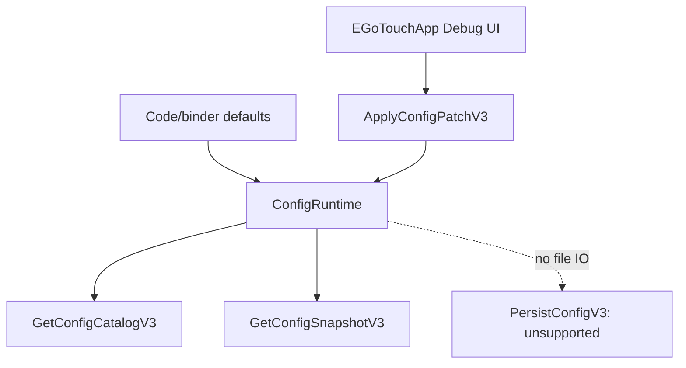

# Config Framework API 文档

> EGoTouchRev 当前 Config v3 实现 API | 更新: 2026-06-10

## 1. 当前边界

当前配置系统只保留两类来源：

| 来源 | 当前状态 | 代码依据 |
| --- | --- | --- |
| 硬编码默认值 | Service 启动时唯一默认来源 | [ConfigRuntime.cpp:111-128](../../EGoTouchService/source/ConfigRuntime.cpp#L111-L128) |
| Debug/上位机会话内动态调整 | 通过 Config v3 catalog/snapshot/patch 修改当前运行实例 | [ConfigRuntime.cpp:701-723](../../EGoTouchService/source/ConfigRuntime.cpp#L701-L723) |
| 文件配置 | 不支持；不读取、不写入、不打包 | [ConfigRuntime.cpp:361-385](../../EGoTouchService/source/ConfigRuntime.cpp#L361-L385) |

`ConfigRuntime` 是 Service 端配置事务权威。App connected mode 通过 `GetConfigCatalogV3`、`GetConfigSnapshotV3` 和 `ApplyConfigPatchV3` 获取/修改当前会话状态；App 不再通过本地配置文件 fallback 构造配置视图，见 [ServiceProxy.Config.cpp:406-456](../../Tools/EGoTouchApp/source/ServiceProxy.Config.cpp#L406-L456)。



## 2. 关键 API

| 模块 | 当前职责 | 文件 |
| --- | --- | --- |
| `ConfigStore` | 内存 flat path → `ConfigValue` 存储、validate、merge | [ConfigStore.h](../../Common/include/config/ConfigStore.h) |
| `ConfigBinder` | C++ default / getter / setter / schema metadata 绑定 | [ConfigBinder.h](../../Common/include/config/ConfigBinder.h) |
| `ConfigCatalog` | defaults + binder metadata 合并为 descriptor/schema | [ConfigCatalog.cpp](../../Common/source/config/ConfigCatalog.cpp) |
| `ConfigKeyMap` | static `ConfigKeyId` ↔ path 双向映射 | [ConfigKeyMap.cpp](../../Common/source/config/ConfigKeyMap.cpp) |
| `ConfigRuntime` | 初始化默认值、构建 catalog/snapshot、应用 patch、拒绝 persist | [ConfigRuntime.cpp](../../EGoTouchService/source/ConfigRuntime.cpp) |

### `ConfigStore`

`ConfigStore` 只保留内存 API：`validate()`、`get()`、`getOr()`、`set()`、`allPaths()`、`has()`、`mergeFrom()`，见 [ConfigStore.h:14-35](../../Common/include/config/ConfigStore.h#L14-L35)。

已移除的文件配置 API：`loadFromYaml()`、`saveToYaml()`、`saveOverrides()`。

### `ConfigRuntime`

- `Initialize()` 忽略 legacy `configPath` 参数，并从代码默认值构造 `m_defaults` / `m_store` / `m_activeStore` / `m_schema`，见 [ConfigRuntime.cpp:361-434](../../EGoTouchService/source/ConfigRuntime.cpp#L361-L434)。
- `ApplyConfigPatchV3()` 保留 version、TLV、schema、target validation，成功后只修改当前 Service 实例，见 [ConfigRuntime.cpp:701-723](../../EGoTouchService/source/ConfigRuntime.cpp#L701-L723)。
- `PersistConfigV3()` 返回 `UnsupportedCommand + PersistFailed`，不写任何文件，见 [ConfigRuntime.cpp:694-701](../../EGoTouchService/source/ConfigRuntime.cpp#L694-L701)。

## 3. 新增/修改配置项规则

| 操作 | 规则 |
| --- | --- |
| 新增 key | 在 owner 的 binder 注册默认值、range、说明、runtime binding；需要 patch 的 key 追加 `ConfigKeyId` 和 `ConfigKeyMap`。 |
| 修改默认值 | 只修改 C++/binder 默认值；不再修改任何外部默认配置文件。 |
| 修改 live/restart 行为 | 修改 binding policy 或 `IConfigTarget` validation/apply，并补 `ConfigRuntimeTest`。 |
| 删除 key | 保留 static `ConfigKeyId` tombstone，不复用旧 ID。 |

`ConfigKeyId` 是 IPC ABI，必须追加式分配，不能复用，映射实现见 [ConfigKeyMap.cpp:14-166](../../Common/source/config/ConfigKeyMap.cpp#L14-L166)。

## 4. 验证清单

```powershell
cmake --preset arm64-Release
cmake --build --preset arm64-Release --target ConfigRuntimeTest EGoTouchApp_ServiceProxyCatalogSchemaTest IPCCoreProtocolAbiTest EGoTouchService EGoTouchApp
ctest --test-dir build/arm64-Release -R "ConfigRuntimeTest|EGoTouchApp\.ServiceProxyCatalogSchemaTest|IPCCoreProtocolAbiTest" --output-on-failure
```

## 小结

- 默认值完全内建于代码。
- 上位机动态调整只影响当前 Service 会话。
- `PersistConfigV3` 保留 wire 入口用于兼容，但语义为不支持持久化。
- 构建、安装、App fallback 均不再依赖配置文件。
