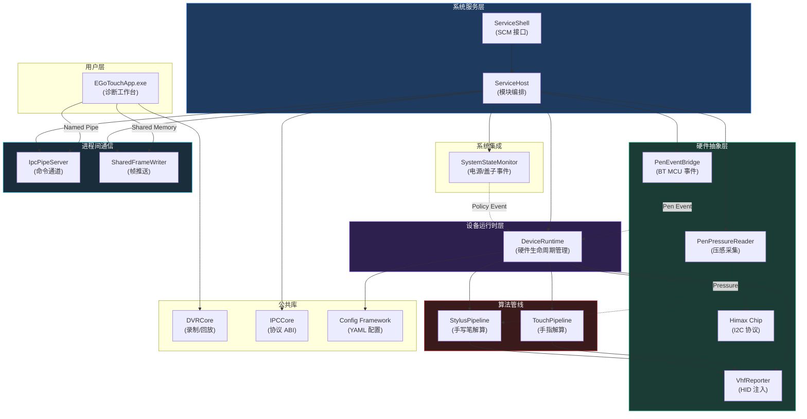
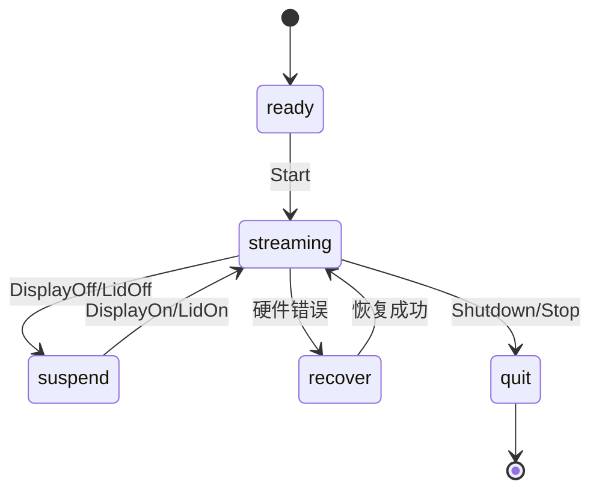
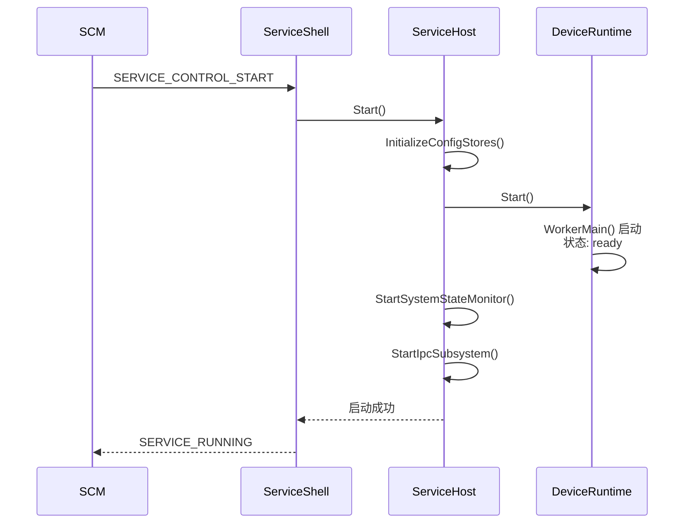

# EGoTouchRev 项目架构总览

> 最后更新：2026-06-07  
> 状态：基于当前 main 分支的整体架构描述

---

## 1. 项目概述

**EGoTouchRev** 是一个开源的 Windows ARM64 原生触摸驱动和服务套件，通过逆向工程为 Himax 电容触摸控制器和配套的蓝牙手写笔提供替代驱动方案。

### 1.1 核心特性

- **原生 ARM64 Windows 服务**：C++ 编写的系统级服务（LocalSystem 权限）
- **硬件深度集成**：Himax 电容芯片协议、BT-MCU 手写笔压感
- **高级算法管线**：抗抖动、抗误触、1-Euro 滤波
- **实时诊断工具**：ImGui 可视化界面，支持 DVR 录制/回放
- **100% ARM64 原生部署**：WiX v4 打包，无 WOW64 模拟

### 1.2 技术栈

| 领域 | 技术选型 |
|------|---------|
| **语言** | C++23 |
| **编译器** | Clang-cl (MSVC 兼容模式) |
| **构建系统** | CMake 3.20+ / Ninja |
| **日志** | spdlog 1.17.0 |
| **配置** | yaml-cpp 0.9.0 |
| **GUI** | ImGui (docking branch) + DirectX 11 |

---

## 2. 系统架构总览

### 2.1 架构分层



### 2.2 层次职责

| 层次 | 职责 | 关键模块 |
|------|------|---------|
| **用户层** | 可视化诊断、配置编辑、DVR 录制回放 | EGoTouchApp |
| **系统服务层** | 服务生命周期管理、模块编排、IPC 分发 | ServiceShell, ServiceHost |
| **设备运行时层** | 硬件生命周期、工作线程调度、算法编排 | DeviceRuntime |
| **硬件抽象层** | I2C 协议、BT-MCU 接口、HID 注入 | Himax, PenBridge, VhfReporter |
| **算法层** | 手指/手写笔解算管线 | TouchPipeline, StylusPipeline |
| **系统集成层** | 电源/盖子事件监控与规范化 | SystemStateMonitor |
| **进程间通信** | App ↔ Service 通信 | IpcPipeServer, SharedFrameWriter |

---

## 3. 核心模块

### 3.1 EGoTouchService（系统服务）

**职责**：Windows 系统级服务，负责硬件采集、算法处理和 HID 注入。

**关键组件**：
- **ServiceShell**：SCM 服务控制接口，接收电源/关机事件
- **ServiceHost**：模块生命周期编排、IPC 命令分发；配置事务权威逐步收敛到 `ConfigRuntime`
- **ServiceConfigCore**：Service 全局配置（模式切换、VHF 开关、笔按钮配置）

**启动顺序**：配置加载 → Runtime 启动 → 系统监控 → IPC 服务器 → Pen 子系统（Full 模式）

---

### 3.2 DeviceRuntime（设备运行时）

**职责**：硬件生命周期管理、工作线程调度、算法管线编排。

**状态机**：



**每帧处理流程**：
```
GetFrame(5063B) → TouchPipeline → StylusPipeline → VHF HID 注入 → Debug 帧推送
```

---

### 3.3 Device 层（硬件抽象）

**子模块清单**：

| 模块 | 职责 | 目录 |
|------|------|------|
| **Himax** | I2C 协议、AFE 命令、帧采集 | `Device/himax/` |
| **BtMcu** | BT-MCU 协议解析（笔事件/压感） | `Device/btmcu/` |
| **PenEventBridge** | 监听 USB HID，注入笔事件 | `Device/penevt/` |
| **PenPressureReader** | 读取 4 通道压感 | `Device/penpress/` |
| **VhfReporter** | HID 注入（PTP 触摸 + 手写笔） | `Device/vhf/` |
| **SyntheticPenButtonInjector** | Win32 按钮合成注入 | `Device/win32/` |

---

### 3.4 Solvers 层（算法管线）

**子模块清单**：

| 模块 | 职责 | 详细文档 |
|------|------|---------|
| **TouchPipeline** | 手指解算（40×60 热图 → 触摸点）<br/>6 阶段管线：解析→信号调理→特征提取→后处理→跟踪→手势 | [touch_pipeline_architecture.md](touch_pipeline_architecture.md) |
| **StylusPipeline** | 手写笔解算（HPP2/HPP3 协议）<br/>支持 TSA Config preset 驱动 | — |

**TouchPipeline 阶段概览**：
1. **帧解析** — 字节流 → int16 矩阵
2. **信号调理** — 自适应基线跟踪 + 共模滤波
3. **特征提取** — 连通域检测 + 峰值检测 + Palm/Finger 分类
4. **后处理** — 质心提取 + 边缘补偿 + 笔触抑制
5. **跟踪与滤波** — Hungarian 匹配 + 1-Euro 滤波
6. **手势** — Down/Drag/LongPress/Up 状态机

---

### 3.5 Host 层（系统集成）

**职责**：监听系统事件（电源、盖子、关机），规范化后下发给 DeviceRuntime。

**关键机制**：
- 接收 SCM 的 `SERVICE_CONTROL_POWEREVENT` / `SERVICE_CONTROL_SHUTDOWN`
- 发布 Named Event：`Global\EGoTouchSystemState_*`
- 规范化为 `RuntimePolicyEvent`（DisplayOn/Off, LidOn/Off, Shutdown, Resume）
- 去重：同批事件（10ms 窗口）优先 canonical，忽略 legacy

---

### 3.6 Common 库（公共基础设施）

**子模块清单**：

| 模块 | 职责 | 目录 |
|------|------|------|
| **Logger** | 基于 spdlog 的统一日志系统 | `Common/include/Logger.h` |
| **Config Framework** | YAML/ConfigStore/ConfigCatalog 配置框架<br/>静态 keyId + TLV patch + v3 Catalog/Snapshot IPC | `Common/include/config/` |
| **DVRCore** | DVR2 二进制录制/回放、CSV 导出 | `Common/DVRCore/` |
| **IPCCore** | IPC 协议 ABI、Named Pipe、Shared Memory | `Common/IPCCore/` |

**配置框架核心流程**：
```
当前过渡态:
ConfigBinder/defaults + default.yaml/overrides.yaml
    → ConfigRuntime
    → ConfigStore + ConfigCatalog adapter
    → GetConfigCatalogV3 / GetConfigSnapshotV3
    → App ServiceProxy schema/store

目标态:
ConfigCatalog
    → generated default.yaml + ConfigRuntime authority
    → v3 Catalog/Snapshot/Patch/Persist IPC
    → App Draft
```

当前 connected App 已优先通过 v3 IPC 获取 Service catalog/snapshot；旧 `GetConfigSnapshot` fixed ABI fallback 后续删除，本地 fallback 保留为 Service 不可用/离线路径。

---

### 3.7 Tools 层（诊断工具）

**EGoTouchApp**（诊断工作台）：
- **实时可视化**：热图、触摸点轨迹、手写笔坐标/压感
- **配置编辑器**：基于 ConfigStore schema 自动生成 UI
- **DVR 录制/回放**：环形缓冲区（960 帧），支持 CSV 导出
- **日志查看**：从 Service 拉取实时日志

**ServiceProxy**（IPC 代理）：
- 封装 Named Pipe + Shared Memory 访问
- 支持 Live（Service 推送）和 Playback（DVR 文件）两种数据源
- connected mode 通过 Service v3 Catalog/Snapshot 建立配置视图；本地 fallback 保留为 Service 不可用/离线场景

---

## 4. 数据流与交互

### 4.1 启动时序



### 4.2 运行时帧处理流程

```
Himax::Chip::GetFrame() → TouchPipeline::Process() → StylusPipeline::Process()
    ↓
VhfReporter::SendTouchReport() + SendStylusReport()
    ↓
SharedFrameWriter::PushFrame()（Debug 模式）
```

### 4.3 系统事件响应（盖子关闭示例）

```
SCM → ServiceShell → Named Event → SystemStateMonitor → ServiceHost
    ↓
DeviceRuntime::IngestPolicyEvent(LidOff)
    ↓
状态切换：streaming → suspend（暂停采帧）
```

---

## 5. 子系统配置管理

### 5.1 配置文件结构

**位置**：`config/default.yaml`（默认值） + `config/overrides.yaml`（用户覆盖）

当前 Service 使用 YAML overlay 进入 `ConfigRuntime`；App connected mode 优先通过 `GetConfigCatalogV3` / `GetConfigSnapshotV3` 获取 Service 配置视图。本地 YAML fallback 只作为 Service 不可用/离线能力保留。未来 `default.yaml` 应由 `ConfigCatalog` 生成或由 CI 校验，避免 Catalog/default.yaml 漂移。

**顶层节点**：

```yaml
service:              # Service 全局配置
  mode: full          # full / touch_only
  auto_mode: true
  stylus_vhf_enabled: true

touch:                # 手指解算配置
  signal_cond:        # 信号调理参数
  peak_detector:      # 峰值检测参数
  tracker:            # 跟踪器参数
  coord_filter:       # 1-Euro 滤波参数

stylus:               # 手写笔解算配置
  protocol: Auto      # Auto / HPP2 / HPP3
  hpp2:               # HPP2 专用配置
  hpp3:               # HPP3 专用配置

vhf:                  # VHF 输出配置
  enabled: true
  transpose: false

device:               # 硬件配置
  himax:              # Himax 芯片参数
```

### 5.2 子系统清单

| 子系统 | 配置节 | 运行时可配置 | 说明 |
|-------|--------|------------|------|
| **手指解算** | `touch.*` | ✅ | 所有 TouchPipeline 参数 |
| **手写笔解算** | `stylus.*` | ✅ | HPP2/HPP3 协议参数 |
| **VHF 输出** | `vhf.*` | ✅（开关） | HID 注入控制 |
| **Himax 硬件** | `device.himax.*` | ❌ | 启动时固定 |
| **系统监控** | `host.*` | ❌ | 电源事件配置 |
| **IPC 服务器** | `ipc.*` | ❌ | 协议参数 |

---

## 6. IPC 通信架构

### 6.1 双通道模型

| 通道 | 类型 | 名称 | 方向 | 用途 |
|------|------|------|------|------|
| **命令通道** | Named Pipe | `\\.\pipe\EGoTouchControl` | 双向 | 命令/响应、配置同步 |
| **帧通道** | Shared Memory | `Global\EGoTouchSharedFrame` | Service → App | 实时 Debug 帧推送 |

### 6.2 IPC 命令分类

| 类别 | 命令示例 | 说明 |
|------|---------|------|
| **生命周期** | `StartRuntime`, `StopRuntime` | 控制 DeviceRuntime |
| **配置管理** | `GetConfigCatalogV3`, `GetConfigSnapshotV3`, `ApplyConfigTlvChunk`, legacy `GetConfigSnapshot` | Service-owned 配置；legacy fixed ABI fallback 后续删除 |
| **VHF 控制** | `SetVhfEnabled`, `SetVhfTranspose` | VHF 输出开关 |
| **调试** | `EnterDebugMode`, `ExitDebugMode` | 开启/关闭 Debug 帧推送 |
| **笔状态** | `GetPenBridgeStatus`, `GetPenIdentityStatus` | 查询笔压感/身份 |
| **动态调试** | `GetDebugSchema`, `GetDebugSnapshot` | 运行时字段查询 |

详见：[ipc_interface_protocol.md](ipc_interface_protocol.md)

---

## 7. 编译与部署

### 7.1 构建目标

| Target | 类型 | 输出 |
|--------|------|------|
| `EGoTouchService` | Executable | 系统服务 |
| `EGoTouchApp` | Executable | 诊断工作台 |
| `BtMcuTestTool` | Executable | BT MCU 协议验证工具 |
| `Common` | Static Library | 公共基础库 |
| `Device` | Static Library | 硬件抽象层 |
| `Solvers` | Static Library | 算法管线 |
| `DVRCore` | Static Library | DVR 录制/回放 |
| `IPCCore` | Static Library | IPC 协议 ABI |

### 7.2 CMake 预设

```json
{
  "configurePresets": [
    {
      "name": "arm64-Release",
      "binaryDir": "${sourceDir}/build/arm64-Release",
      "cacheVariables": {
        "CMAKE_BUILD_TYPE": "Release",
        "HIMAX_ENABLE_NEON": "ON",
        "EGOTOUCH_ENABLE_RUNTIME_CONFIG": "ON"
      }
    }
  ]
}
```

### 7.3 部署结构

**Service 安装路径**：`C:\Program Files\EGoTouchRev\`
```
EGoTouchRev/
├── EGoTouchService.exe
└── config/
    ├── default.yaml
    └── overrides.yaml
```

**数据目录**：`C:\ProgramData\EGoTouchRev\`
```
EGoTouchRev/
├── logs/
└── config/
    └── overrides.yaml  (用户覆盖；legacy config.ini 不是目标格式)
```

---

## 8. 性能指标

### 8.1 延迟（ARM64 Release）

| 阶段 | 平均耗时 |
|------|---------|
| I2C 帧采集 | 8-12 ms |
| TouchPipeline | 0.5-1.2 ms |
| StylusPipeline | 0.1-0.3 ms |
| VHF 注入 | 0.05-0.1 ms |
| **总延迟** | **9-14 ms** (约 100 Hz) |

### 8.2 资源占用

| 组件 | 工作集 | CPU（空闲） | CPU（5 指触摸） |
|------|--------|------------|----------------|
| EGoTouchService | 15-25 MB | 0.3-0.8% | 2.5-4.0% |
| EGoTouchApp | 80-120 MB | — | — |

---

## 9. 关键文档索引

| 文档 | 说明 |
|------|------|
| [architecture_redesign.md](architecture_redesign.md) | 详细架构设计（当前已落地代码对齐） |
| [touch_pipeline_architecture.md](touch_pipeline_architecture.md) | TouchPipeline 6 阶段完整解析 |
| [ipc_interface_protocol.md](ipc_interface_protocol.md) | IPC 协议规范（42 种命令） |
| [api/config_framework_api.md](api/config_framework_api.md) | 配置框架 API 文档 |
| [api/shared_memory_abi.md](api/shared_memory_abi.md) | SharedMemory ABI 规范 |

---

## 小结

EGoTouchRev 采用**分层清晰、职责明确**的架构设计：

- **服务层** → **运行时层** → **硬件层** → **算法层** 四层解耦
- **双通道 IPC**：Named Pipe（命令）+ Shared Memory（实时帧）
- **统一配置框架**：YAML 驱动、编译时绑定、运行时零开销
- **模块化算法管线**：TouchPipeline 6 阶段、StylusPipeline 双协议支持
- **完备的诊断工具**：实时可视化、配置编辑、DVR 录制回放

核心设计原则：**低延迟、高性能、可维护、可扩展**。
