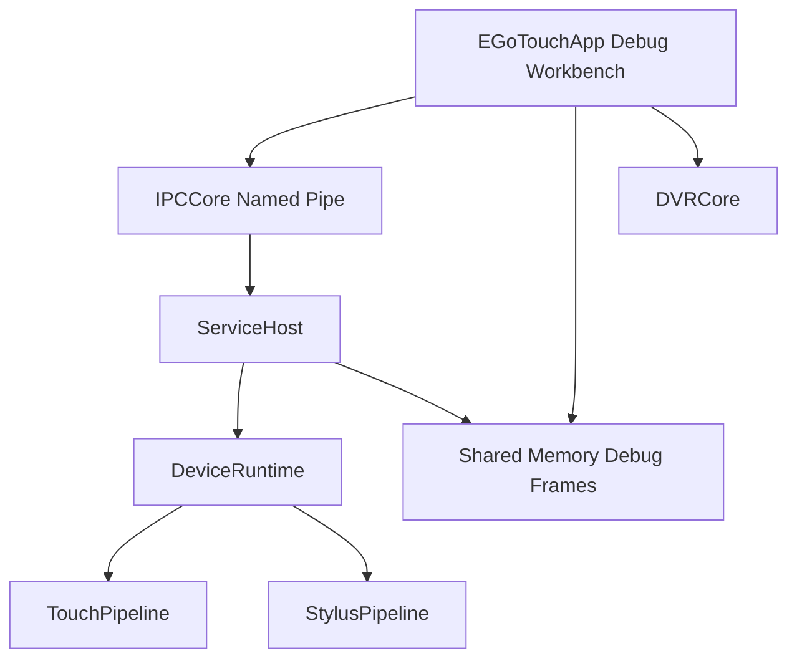
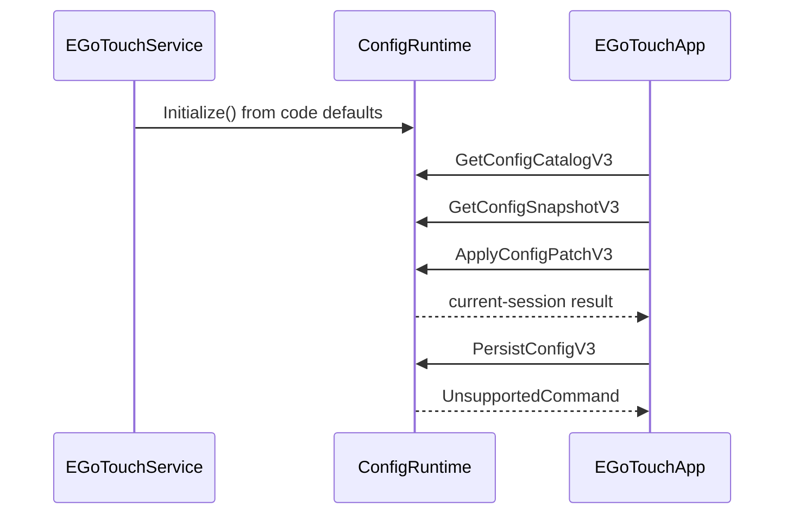

# EGoTouchRev 项目架构总览

> 最后更新：2026-06-10

## 1. 项目概述

EGoTouchRev 是 Windows ARM64 原生触摸驱动和服务套件，为 Himax 电容触摸控制器和配套蓝牙手写笔提供 Service、算法管线、VHF HID 注入和诊断上位机。

| 领域 | 技术选型 |
| --- | --- |
| 语言 | C++23 |
| 构建系统 | CMake / Ninja |
| 日志 | spdlog |
| GUI | ImGui + DirectX 11 |
| 配置 | 代码默认值 + Debug/上位机会话内动态调整 |

## 2. 系统架构



| 层次 | 职责 |
| --- | --- |
| `EGoTouchService` | SCM 生命周期、IPC 分发、设备运行时编排 |
| `DeviceRuntime` | 硬件生命周期、采集线程、pipeline apply |
| `Solvers` | Touch/Stylus 解算与运行时参数应用 |
| `EGoTouchApp` | Debug 可视化、session-only 参数调整、DVR |
| `Common` | 日志、ConfigStore/Catalog/TLV、DVR、IPC ABI |

## 3. 配置边界

当前配置链路：



关键事实：

- Service 默认值来自 `WithRuntimeConfigDefaults()`，见 [ConfigRuntime.cpp:111-128](../EGoTouchService/source/ConfigRuntime.cpp#L111-L128)。
- Service 初始化不读取配置文件，见 [ConfigRuntime.cpp:361-385](../EGoTouchService/source/ConfigRuntime.cpp#L361-L385)。
- App 初始化只使用内建 defaults，不读取本地配置文件 fallback，见 [ServiceProxy.Config.cpp:406-456](../Tools/EGoTouchApp/source/ServiceProxy.Config.cpp#L406-L456)。
- `PersistConfigV3()` 返回不支持，见 [ConfigRuntime.cpp:694-701](../EGoTouchService/source/ConfigRuntime.cpp#L694-L701)。

## 4. 部署结构

Service 安装目录不再包含配置文件目录：

```text
EGoTouchRev/
├── EGoTouchService.exe
└── EGoTouchApp.exe
```

WiX 不再声明配置文件 component；CMake install 只安装可执行目标，见 [CMakeLists.txt:312-339](../CMakeLists.txt#L312-L339)。

## 5. 文档索引

| 文档 | 说明 |
| --- | --- |
| [api/config_framework_api.md](api/config_framework_api.md) | Config v3 当前 API 与边界 |
| [api/ipc_protocol.md](api/ipc_protocol.md) | IPC wire 协议 |
| [ipc_interface_protocol.md](ipc_interface_protocol.md) | IPC 命令索引 |
| [touch_pipeline_architecture.md](touch_pipeline_architecture.md) | TouchPipeline 处理链 |

## 小结

- 运行时默认配置完全内建。
- Debug 上位机可以 session-only 修改当前 Service 实例。
- 文件配置、文件持久化和安装包配置资产已从当前架构中移除。
