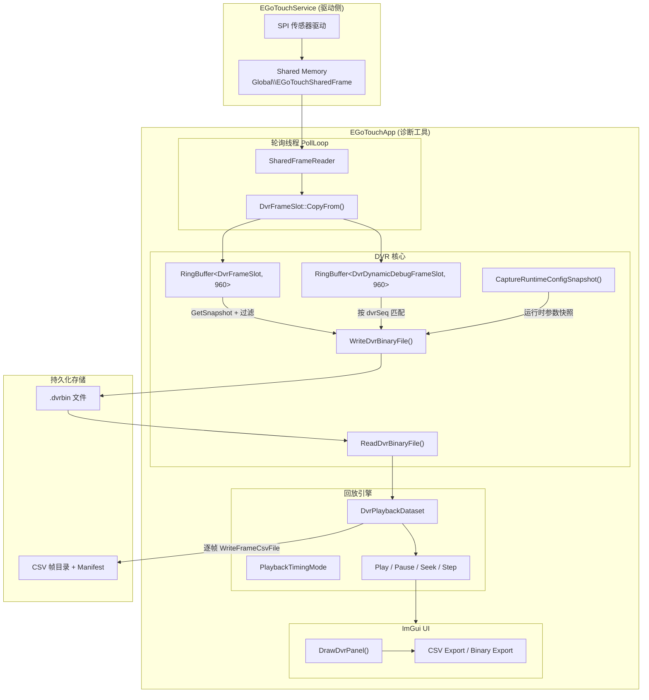
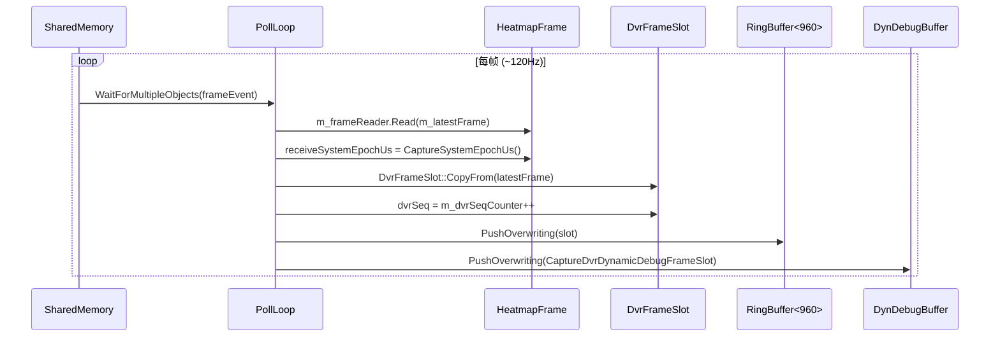
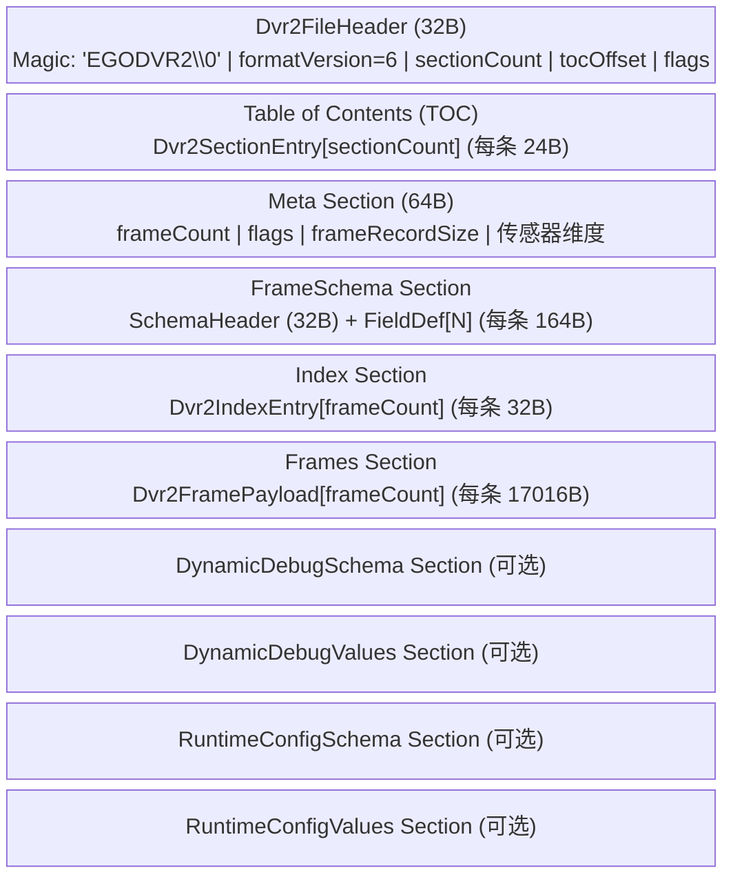
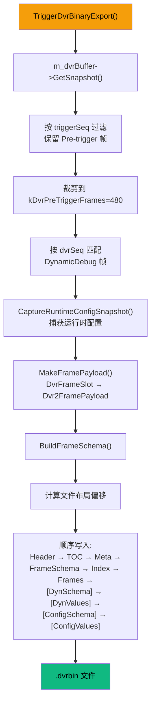
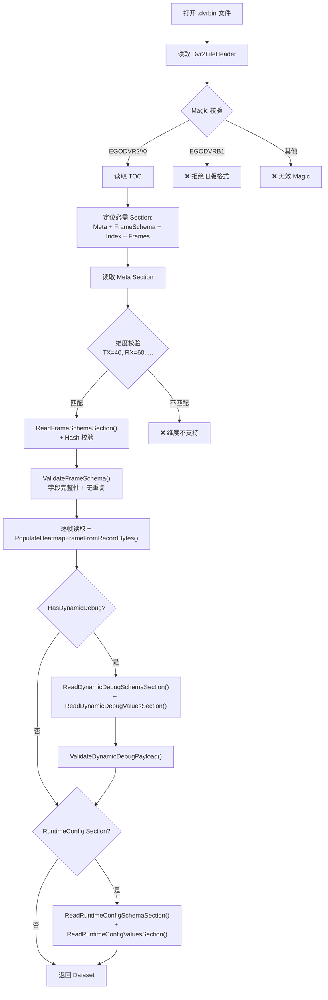
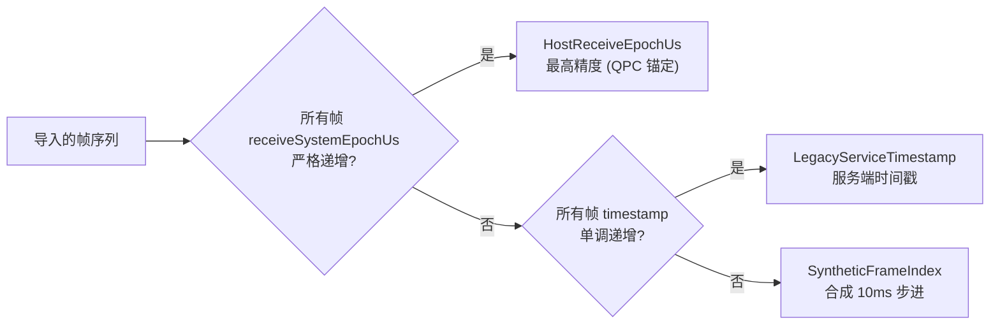
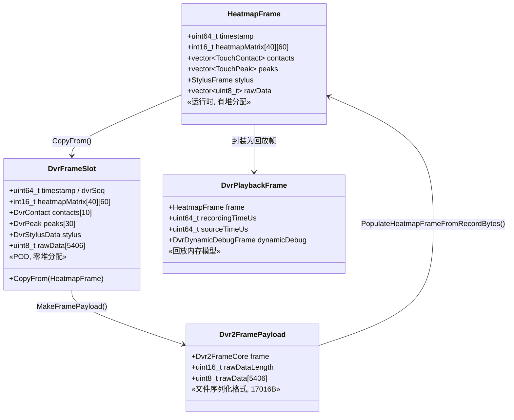

# EGoTouch DVR 录制系统架构分析

## 概述

DVR（Digital Video Recorder）系统是 EGoTouch 触控诊断平台的核心调试子系统，负责**实时捕获、持久化、回放和导出**触控传感器的逐帧数据。该系统设计了一种自描述的二进制文件格式（DVR2），支持高性能零拷贝采集、Pre-Trigger 回溯导出、Schema-Driven 帧解析、动态调试字段扩展以及录制时运行配置快照。

### 关键设计目标

| 目标 | 实现方式 |
|------|---------|
| 零堆分配实时采集 | 纯 POD `DvrFrameSlot` + 固定大小环形缓冲区 |
| 自描述二进制格式 | Section-based TOC + 内嵌 FrameSchema |
| 向前/向后兼容 | Schema Hash 校验 + Optional 字段 `Try*` 读取 |
| 运行时调试扩展 | DynamicDebug Schema/Values 独立 Section |
| 录制时配置追溯 | RuntimeConfig Schema/Values 独立 Section，直接来自运行时对象 |
| 精确时间回放 | 三级时间基准自动选择 |

---

## 系统架构总览



---

## 模块分解

### 1. 数据采集层

#### 文件: [ServiceProxy.Polling.cpp](file:///d:/source/repos/EGoTouchRev-rebuild/Tools/EGoTouchApp/source/ServiceProxy.Polling.cpp)

轮询线程 `PollLoop()` 是整个 DVR 系统的数据源入口。



**关键设计点：**

- **高精度主机时间戳**：`CaptureSystemEpochUs()` 使用 `QueryPerformanceCounter` + `system_clock` 锚定，提供微秒级 Unix epoch 时间戳
- **零堆分配**：[DvrFrameSlot](file:///d:/source/repos/EGoTouchRev-rebuild/Tools/EGoTouchApp/include/DvrFrameSlot.h) 是纯 POD 结构，所有字段都是固定大小数组，`PushOverwriting` 归结为单次 `memcpy`
- **序列号分配**：`dvrSeq` 由原子计数器 `m_dvrSeqCounter` 全局递增，用于后续 Dynamic Debug 帧匹配

#### 文件: [DvrFrameSlot.h](file:///d:/source/repos/EGoTouchRev-rebuild/Tools/EGoTouchApp/include/DvrFrameSlot.h)

| 嵌套结构 | 大小 | 内容 |
|----------|------|------|
| `DvrContact` | 80B | 触点坐标、状态、面积、Edge 补偿、生命周期标志 |
| `DvrPeak` | 12B | 热图峰值行列坐标 + Z 值 |
| `DvrTouchPacket` | 36B | VHF 触控 HID 报告包 |
| `DvrStylusPacket` | 24B | 触控笔 HID 报告包 |
| `DvrStylusPoint` | ~64B | 笔尖坐标、压力、倾斜角、TX 信号 |
| `DvrStylusData` | ~152B | 完整笔诊断数据 |
| `DvrFrameSlot` | ~17KB | 时间戳 + 热图矩阵 + 原始SPI数据 + 所有子结构 |

---

### 2. DVR2 二进制文件格式

#### 文件: [DvrFormat.h](file:///d:/source/repos/EGoTouchRev-rebuild/Tools/EGoTouchApp/include/DvrFormat.h)

DVR2 是一种 **Section-based 自描述二进制格式**，文件扩展名 `.dvrbin`，当前版本 **v6**。

#### 文件布局



#### Section 类型枚举

| 类型 | ID | 版本 | 必须 | 说明 |
|------|----|------|------|------|
| `Meta` | 1 | 1 | ✅ | 数据集元信息（帧计数、传感器维度、特性标志） |
| `Index` | 2 | 1 | ✅ | 帧时间戳索引，支持随机访问 |
| `Frames` | 3 | 1 | ✅ | 帧负载数据区 |
| `DynamicDebugSchema` | 4 | 1 | ❌ | 动态调试字段描述符 |
| `DynamicDebugValues` | 5 | 1 | ❌ | 逐帧动态调试采样值 |
| `FrameSchema` | 6 | 1 | ✅ | 帧记录字段布局描述 |
| `RuntimeConfigSchema` | 7 | 1 | ❌ | 录制时配置字段描述符 |
| `RuntimeConfigValues` | 8 | 1 | ❌ | 录制时配置当前值 |

#### 特性标志 (DvrBinaryFlags)

| 标志 | 位 | 含义 |
|------|-----|------|
| `kDvrFlagHasStylusDiagnostics` | bit 0 | 包含触控笔诊断数据 |
| `kDvrFlagHasStructuredSuffix` | bit 1 | 包含结构化后缀数据 |
| `kDvrFlagHasReceiveSystemEpochUs` | bit 2 | 包含高精度主机接收时间戳 |
| `kDvrFlagHasDynamicDebug` | bit 3 | 包含动态调试 Section |
| `kDvrFlagHasRuntimeConfig` | bit 4 | 包含运行时配置快照 Section |

#### FrameSchema — 自描述帧布局

FrameSchema 是 DVR2 的核心设计，使文件能够**自我描述帧记录的每个字段**。每个字段由 [Dvr2FieldDef](file:///d:/source/repos/EGoTouchRev-rebuild/Tools/EGoTouchApp/include/DvrFormat.h#L118-L135) (164B) 定义：

```
┌────────────┬────────────┬──────────┬──────────┬─────────────┐
│  fieldId   │   offset   │   size   │ valueType│    rank      │
├────────────┼────────────┼──────────┼──────────┼─────────────┤
│ elementSize│elementCount│  stride  │ rows/cols│   group      │
├────────────┼────────────┴──────────┴──────────┴─────────────┤
│   flags    │ path[64] | displayName[48] | unit[16]          │
└────────────┴────────────────────────────────────────────────┘
```

**字段类型体系：**

- **ValueType**: `UInt8 / UInt16 / UInt32 / UInt64 / Int16 / Int32 / Float32 / Bool / Bytes`
- **FieldRank**: `Scalar / Array / Matrix / StructArray`
- **FieldGroup**: `Frame / Heatmap / MasterSuffix / SlaveSuffix / Stylus / Contacts / Peaks / Raw / TouchPackets / Diagnostics`

**Schema Hash 校验**：使用 FNV-1a 变体对所有 FieldDef 的字节序列计算 hash，写入时嵌入 Meta 和 FrameSchemaHeader 中，读取时双重校验确保一致性。

> [!IMPORTANT]
> `BuildFrameSchema()` 函数（[L409-L545](file:///d:/source/repos/EGoTouchRev-rebuild/Tools/EGoTouchApp/include/DvrFormat.h#L409-L545)）以 `offsetof` 驱动自动生成 ~110 个字段定义，确保 Schema 与 `Dvr2FramePayload` 的内存布局严格一致。

#### RuntimeConfig — 录制时运行配置快照

RuntimeConfig 使用与 Dynamic Debug 类似的可选自描述 Section 组合，不修改 `Dvr2FramePayload`，因此旧 DVR2 读取器仍可通过必需的 `Meta / FrameSchema / Index / Frames` 打开帧数据。

| Wire 结构 | 内容 |
|-----------|------|
| `Dvr2RuntimeConfigSchemaHeader` | `schemaVersion / fieldCount / schemaHash / recordSize` |
| `Dvr2RuntimeConfigFieldDef` | `section / key / displayName / moduleTag / unit / category / min / max / valueType` |
| `Dvr2RuntimeConfigValuesHeader` | `valueCount / recordSize / schemaHash` |
| `Dvr2RuntimeConfigValueRecord` | `fieldId / valueType / valid flag / rawValue / stringValue` |

配置来源是导出瞬间的运行时对象：`ServiceProxy` 内部 atomics、`TouchPipeline::GetConfigSchema()`、`StylusPipeline::GetConfigSchema()`。导出路径不会反读 `config.ini`；如果 MasterParser-only 模式正在生效，记录的是当时 `m_pipeline` 实际生效值。

---

### 3. 写入管线

#### 文件: [ServiceProxy.Dvr.cpp](file:///d:/source/repos/EGoTouchRev-rebuild/Tools/EGoTouchApp/source/ServiceProxy.Dvr.cpp) — `WriteDvrBinaryFile()` (L1079-L1235)



**Pre-Trigger 导出策略：**

- 环形缓冲区容量 `kDvrCapacity = 960` 帧（≈8 秒 @120Hz）
- 导出时截取 `kDvrPreTriggerFrames = 480` 帧（≈4 秒）
- 仅导出 `dvrSeq <= triggerSeq` 的帧（触发点之前的历史数据）
- **导出在独立线程执行**，通过 `m_dvrExporting` 原子标志防止并发
- **运行配置快照**：导出线程调用 `CaptureRuntimeConfigSnapshot()`，将 Service/App runtime 字段与 Touch/Stylus pipeline 当前参数写入可选 RuntimeConfig Section

**帧转换链：**

```
HeatmapFrame (运行时, 有堆分配)
       ↓  DvrFrameSlot::CopyFrom()
DvrFrameSlot (POD, 零拷贝缓冲)
       ↓  MakeFramePayload()
Dvr2FramePayload (17016B, 文件序列化格式)
```

---

### 4. 读取管线

#### 文件: [ServiceProxy.Dvr.cpp](file:///d:/source/repos/EGoTouchRev-rebuild/Tools/EGoTouchApp/source/ServiceProxy.Dvr.cpp) — `ReadDvrBinaryFile()` (L1237-L1423)

读取流程实施了**严格的分层校验**：



**Schema-Driven 帧解析的关键特性：**

- **Required 字段**：使用 `ReadScalarField()` / `CopyContiguousField()`，缺失即报错
- **Optional 字段**：使用 `TryReadScalarField()` / `TryCopyContiguousField()`，缺失时保留默认值
- **Strided 数组读取**：`ReadStridedField()` 支持 StructArray 中按 stride 定位元素（如 Contacts 数组中的各字段）
- **RuntimeConfig 读取**：如果存在 `RuntimeConfigSchema` / `RuntimeConfigValues`，读取器校验 record size、schema hash、field/value 数量和 valueType；如果只存在半截配置 Section 则拒绝文件，避免误用不完整配置

> [!TIP]
> 这种 Required/Optional 分层设计使得新版本可以添加字段而不破坏旧版本的读取能力，同时旧文件也能被新版本正确解析（缺失的新字段使用默认值）。

---

### 5. 回放引擎

#### 文件: [ServiceProxy.Playback.cpp](file:///d:/source/repos/EGoTouchRev-rebuild/Tools/EGoTouchApp/source/ServiceProxy.Playback.cpp)

#### 三级时间基准自动选择



| 模式 | 时间源 | 精度 | 适用场景 |
|------|--------|------|---------|
| `HostReceiveEpochUs` | QPC 锚定的 Unix 微秒 | ~1μs | 新版 DVR2 导出 |
| `LegacyServiceTimestamp` | Service 端原始时间戳 | ~ms | 旧版格式兼容 |
| `SyntheticFrameIndex` | `帧索引 × 10000μs` | 10ms 固定步进 | 时间戳损坏/缺失 |

`LoadDvrDataset()` 会把解析出的 Dynamic Debug schema/values 和 RuntimeConfig snapshot 一起保存到 `DvrPlaybackDataset`。回放后的 CSV 导出使用 DVR 文件内嵌配置，而不是当前 App 的 `m_pipeline` 或磁盘上的 `config.ini`。

#### 回放控制接口

所有操作都通过 `m_playbackMutex` 保护，支持：

- **Play/Pause**：实时驱动，按 `steady_clock` 经过时间推进时间轴
- **Step Forward/Backward**：逐帧步进，自动暂停
- **SeekFrame(index)**：按帧索引跳转
- **SeekTimeUs(timeUs)**：按时间戳跳转，线性搜索最近帧

---

### 6. CSV 导出

#### 文件: [ServiceProxy.Dvr.cpp](file:///d:/source/repos/EGoTouchRev-rebuild/Tools/EGoTouchApp/source/ServiceProxy.Dvr.cpp) — `WriteFrameCsvFile()` (L1425-L1627)

每帧导出一个 CSV 文件，包含以下分节：

```
--- EGoTouch Frame Export ---     (元信息)
--- Config Parameters ---         (DVR 内嵌 RuntimeConfig；当前帧手工导出时为本地 TouchPipeline)
--- Peaks ---                     (峰值表)
--- Contacts ---                  (触点表)
--- Touch Packets (VHF 0x20) ---  (HID 报告包十六进制)
--- Heatmap (40 rows x 60 cols) ---(热图矩阵)
--- Master Status ---             (主控状态 + 动态调试字段)
--- Slave Status ---              (从控状态 + 触控笔全量诊断)
--- Master Frame Suffix ---       (主控后缀原始 words)
--- Slave Frame Suffix ---        (从控后缀原始 words)
--- Dynamic Debug ---             (动态调试独立字段)
```

整个 Dataset 导出时还会生成 `dataset_manifest.csv`，记录帧计数、格式版本、时间范围，以及 `ConfigSnapshotPresent / ConfigFieldCount / ConfigSchemaHash`。旧 DVR2 文件没有 RuntimeConfig Section 时，manifest 中 `ConfigSnapshotPresent=0`，CSV 不会用当前 App 配置冒充录制时配置。

**Dynamic Debug 插入机制**：通过 `ApplyDynamicRows()` 将动态字段按 `dvrTarget` 分发到不同的 CSV Section，并通过 `dvrPositionMode`（Append / AfterAnchor / Index）控制插入位置。

---

### 7. UI 层

#### 文件: [DiagnosticsWorkbench.Dvr.cpp](file:///d:/source/repos/EGoTouchRev-rebuild/Tools/EGoTouchApp/source/DiagnosticsWorkbench.Dvr.cpp)

ImGui 面板 `DrawDvrPanel()` 提供：

| 功能区 | 操作 |
|--------|------|
| **Binary DVR Export** | 触发 Pre-Trigger 二进制导出（Live 模式限定） |
| **DVR Playback** | 文件选择器导入 .dvrbin → 自动切换 Playback 模式 |
| **Playback Controls** | Play / Pause / Prev / Next / 滑块 Seek / 时间信息显示 |
| **CSV Export** | 将已加载的 DVR Dataset 批量转换为 CSV |

---

## 环形缓冲区设计

#### 文件: [ConcurrentRingBuffer.h](file:///d:/source/repos/EGoTouchRev-rebuild/Tools/EGoTouchApp/include/ConcurrentRingBuffer.h)

```
RingBuffer<DvrFrameSlot, 960>
├─ PushOverwriting()   ← PollLoop (生产者, 单线程)
├─ GetSnapshot()       ← TriggerDvrBinaryExport (消费者, 导出线程)
└─ 实现: mutex + condition_variable
```

> [!NOTE]
> 每个 `DvrFrameSlot` 约 17KB，`RingBuffer<960>` 总内存占用约 **16MB**。加上 `DvrDynamicDebugFrameSlot` 的缓冲区（每帧 ~4KB, 960帧 ≈ 3.8MB），DVR 子系统总计静态内存约 **20MB**。

---

## 数据类型层次



---

## 关键源文件索引

| 文件 | 职责 | 核心函数/类 |
|------|------|------------|
| [DvrFormat.h](file:///d:/source/repos/EGoTouchRev-rebuild/Tools/EGoTouchApp/include/DvrFormat.h) | 文件格式定义 + Schema 构建 | `BuildFrameSchema()`, `Dvr2FramePayload`, `Dvr2FieldDef` |
| [DvrFrameSlot.h](file:///d:/source/repos/EGoTouchRev-rebuild/Tools/EGoTouchApp/include/DvrFrameSlot.h) | 零拷贝 POD 帧槽 | `DvrFrameSlot::CopyFrom()` |
| [ServiceProxyTypes.h](file:///d:/source/repos/EGoTouchRev-rebuild/Tools/EGoTouchApp/include/ServiceProxyTypes.h) | 回放/动态调试/运行配置类型 | `DvrPlaybackDataset`, `DvrDynamicDebugSchema`, `DvrRuntimeConfigSnapshot` |
| [ServiceProxy.h](file:///d:/source/repos/EGoTouchRev-rebuild/Tools/EGoTouchApp/include/ServiceProxy.h) | DVR 公共接口 | `TriggerDvrBinaryExport()`, `LoadDvrDataset()` |
| [ServiceProxy.Dvr.cpp](file:///d:/source/repos/EGoTouchRev-rebuild/Tools/EGoTouchApp/source/ServiceProxy.Dvr.cpp) | 写入/读取/CSV导出 | `WriteDvrBinaryFile()`, `ReadDvrBinaryFile()`, `WriteFrameCsvFile()` |
| [ServiceProxy.Playback.cpp](file:///d:/source/repos/EGoTouchRev-rebuild/Tools/EGoTouchApp/source/ServiceProxy.Playback.cpp) | 回放引擎 | `LoadDvrDataset()`, `UpdatePlayback()`, `SeekPlaybackFrame()` |
| [ServiceProxy.Polling.cpp](file:///d:/source/repos/EGoTouchRev-rebuild/Tools/EGoTouchApp/source/ServiceProxy.Polling.cpp) | 实时采集 | `PollLoop()` |
| [ConcurrentRingBuffer.h](file:///d:/source/repos/EGoTouchRev-rebuild/Tools/EGoTouchApp/include/ConcurrentRingBuffer.h) | 线程安全环形缓冲 | `RingBuffer<T, Capacity>` |
| [DiagnosticsWorkbench.Dvr.cpp](file:///d:/source/repos/EGoTouchRev-rebuild/Tools/EGoTouchApp/source/DiagnosticsWorkbench.Dvr.cpp) | ImGui UI | `DrawDvrPanel()` |
| [IpcProtocol.h](file:///d:/source/repos/EGoTouchRev-rebuild/Common/include/IpcProtocol.h) | Dynamic Debug 协议定义 | `DebugFieldSchemaWire`, `DebugDvrTarget` |
