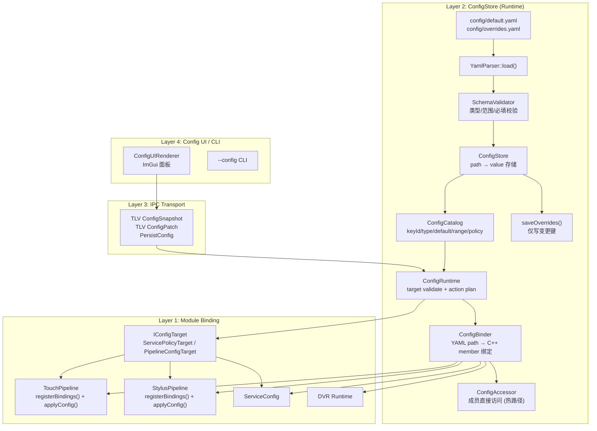
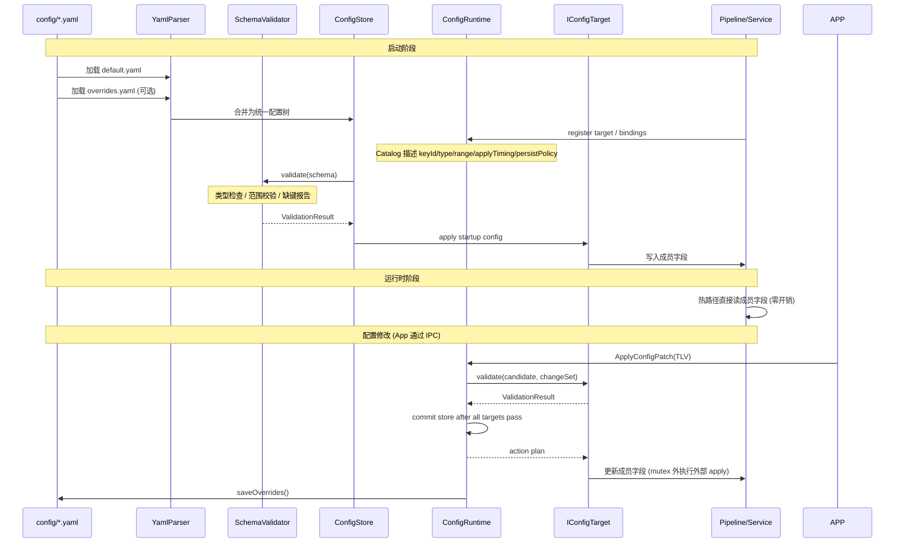
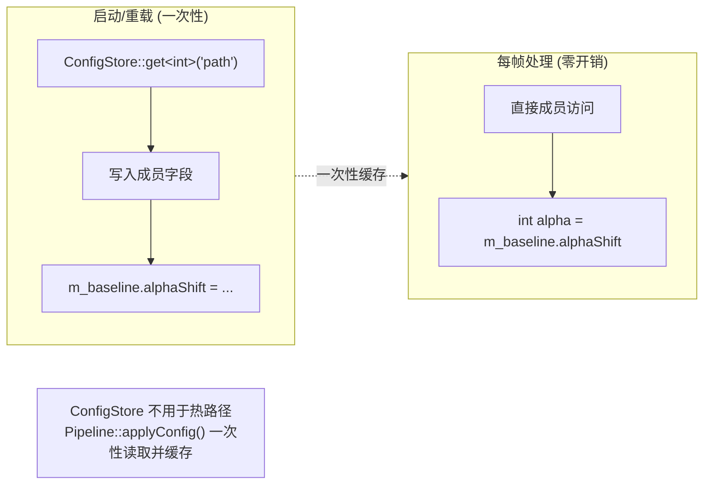
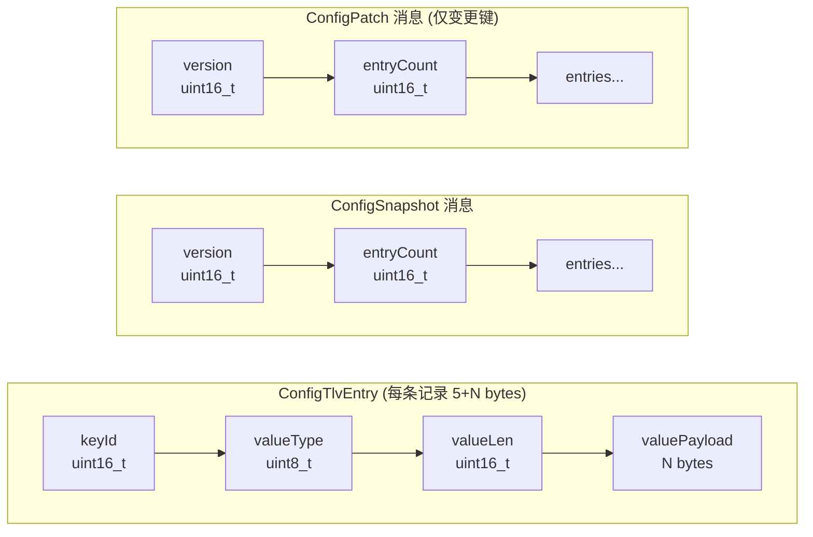
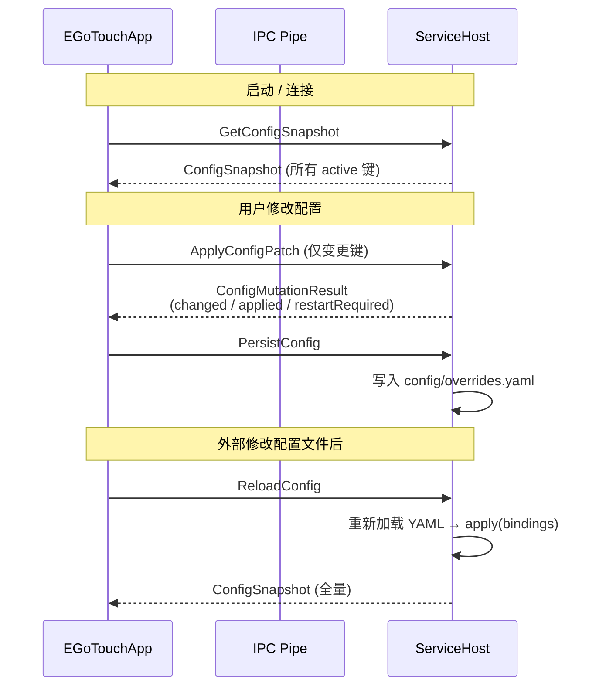
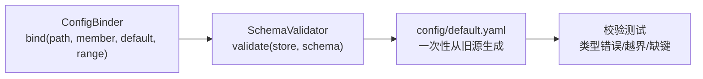
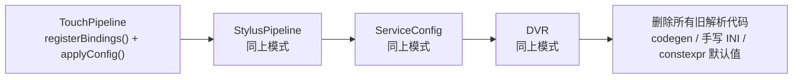
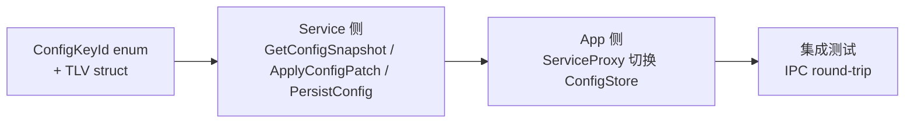
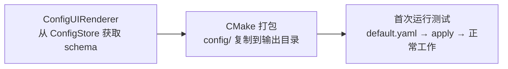

# Config 配置系统重构方案 — 纯运行时 Config-Driven 架构

> 日期: 2026-06-05 | 策略: 完全重构, 不兼容旧格式 | 原则: 配置文件是唯一权威数据源

> 当前实现进度: 截至 2026-06-08，P1-3 Catalog 策略字段、P1-4 `IConfigTarget` registry、P1-5 runtime-derived `default.yaml` drift check、P1-6 v3 Patch/Persist result 已合入并通过 review。当前架构仍是 v3 过渡态：Catalog/Snapshot/Patch/Persist v3 IPC 已落地，ConfigRuntime 已通过 target validate/rollback/action plan 管理 live patch 与 restart-required staged patch；App `ConfigDraft`、legacy fixed ABI cleanup、build macro cleanup、packaging/e2e 仍待完成。

---

## 一、目标架构

### 1.1 核心原则

1. **配置文件是唯一权威数据源** — 所有可配置值来自 `default.yaml`, 用户覆盖来自 `overrides.yaml`
2. **无代码生成, 无编译期硬编码** — 修改配置不需要重新编译; 发行时携带配置文件
3. **运行时加载 + Schema 校验** — 启动时加载, 类型错误/越界/缺键在启动阶段精确报告

### 1.2 格式选择

| 维度 | INI | JSON | YAML |
|------|-----|------|------|
| 嵌套结构 | :x: | :white_check_mark: | :white_check_mark: |
| 注释支持 | :white_check_mark: | :x: | :white_check_mark: |
| 类型系统 | :x: 全字符串 | :white_check_mark: | :white_check_mark: |
| 人工可读 | :yellow_circle: | :yellow_circle: | :white_check_mark: |
| C++ 依赖 | 手写 | nlohmann/json (header-only) | yaml-cpp (~1MB) |

**选择: YAML**。备选: 如 yaml-cpp 二进制增量超标, 切换 nlohmann/json + JSONC 注释扩展。

### 1.3 配置文件布局

```
安装目录/
├── EGoTouchService.exe
├── EGoTouchApp.exe
└── config/
    ├── default.yaml       ← 出厂默认 (随产品发行, 所有键+文档注释)
    └── overrides.yaml     ← 用户覆盖 (首次修改配置时自动创建)
```

加载优先级:
1. `--config <dir>` CLI 参数
2. `EGOTOUCH_CONFIG_DIR` 环境变量
3. `./config/` 可执行文件同目录
4. 启动失败 — 必须找到 `default.yaml`

### 1.4 架构分层



### 1.5 加载流程



### 1.6 热路径读取模型



---

## 二、核心组件设计

### 2.1 ConfigStore — 统一配置存储

```cpp
// Common/include/config/ConfigStore.h

class ConfigStore {
public:
    // ── 加载 ──
    void loadFromYaml(const std::string& path);          // 加载并合并 YAML
    ValidationResult validate(const Schema& schema) const;

    // ── 读取 ──
    template<typename T>
    T get(std::string_view path) const;

    template<typename T>
    T getOr(std::string_view path, T fallback) const;    // 缺键回退

    // ── 写入 ──
    template<typename T>
    void set(std::string_view path, T value);

    // ── UI / IPC ──
    ConfigSnapshot snapshot() const;
    ConfigMutationResult applyPatch(const ConfigPatch& patch);

    // ── 持久化 ──
    void saveToYaml(const std::string& path) const;
    void saveOverrides(const std::string& path);         // 仅写与 default 不同的键

    // ── 元数据 ──
    std::vector<std::string> allPaths() const;
    bool has(std::string_view path) const;

private:
    struct Entry {
        ConfigValue value;
        ConfigValue defaultValue;
        ConfigValue minVal, maxVal;
        std::string description;
    };
    std::unordered_map<std::string, Entry> m_entries;
};
```

### 2.2 ConfigBinder — YAML path → C++ member 绑定

替代 codegen 的核心机制。每个模块用一行 C++ 声明一个绑定:

```cpp
// TouchPipeline.cpp

void TouchPipeline::registerBindings(ConfigBinder& binder) {
    using Range = ConfigRange;

    // 每个键: (YAML路径, 成员指针, 默认值, 范围, 描述)
    binder.bind("touch.signal_cond.baseline_bg_alpha_shift",
                &BaselineParams::backgroundAlphaShift, m_baseline,
                3, Range{0, 15}, "Background alpha shift for baseline tracking");

    binder.bind("touch.signal_cond.baseline_no_finger_alpha_shift",
                &BaselineParams::noFingerAlphaShift, m_baseline,
                3, Range{0, 15}, "No-finger alpha shift for baseline tracking");

    binder.bind("touch.signal_cond.baseline_recovery_max_frames",
                &BaselineParams::recoveryMaxFrames, m_baseline,
                30, Range{1, 120}, "Max frames for baseline recovery");

    // 模块开关 (bool 键)
    binder.bind("touch.frame_parser.enabled",
                &TouchPipeline::m_frameParserEnabled, *this,
                true, "Frame Parser enable switch");
}

void TouchPipeline::applyConfig(const ConfigStore& store) {
    // 可选的显式读取 — 或者 ConfigBinder::apply() 自动完成
    // 此处可做 "键 X 变更 → 重置模块 Y" 的联动逻辑
}
```

`ConfigBinder` 接口:

```cpp
class ConfigBinder {
public:
    // 基础绑定: 值类型 (int, float, bool)
    template<typename Struct, typename T>
    void bind(std::string_view yamlPath,
              T Struct::*member, Struct& instance,
              T defaultValue,
              ConfigRange range = {},
              std::string_view description = "");

    // 枚举绑定
    template<typename Struct, typename Enum>
    void bind(std::string_view yamlPath,
              Enum Struct::*member, Struct& instance,
              Enum defaultValue,
              std::span<const std::pair<Enum, const char*>> enumMapping,
              std::string_view description = "");

    // 从 ConfigStore 读取值并写入所有绑定成员
    void apply(const ConfigStore& store);

    // 从绑定生成 Schema (用于校验)
    Schema toSchema() const;

    // 从绑定生成 ConfigStore 默认值 (用于首次写入 overrides.yaml)
    void writeDefaults(ConfigStore& store) const;

private:
    std::vector<BindingEntry> m_bindings;
};
```

### 2.3 SchemaValidator — 启动时校验

```cpp
struct ValidationIssue {
    enum Severity { Error, Warning };
    Severity severity;
    std::string path;       // "touch.signal_cond.baseline_bg_alpha_shift"
    std::string message;    // "value 500 exceeds max 2000, clamped to 2000"
};

struct ValidationResult {
    bool ok() const { return errors.empty(); }
    std::vector<ValidationIssue> errors;
    std::vector<ValidationIssue> warnings;

    void logAll() const;  // LOG_ERROR / LOG_WARN 每个问题
};

class SchemaValidator {
public:
    // 从 Schema 文件加载规则 (config/schema.yaml)
    static Schema loadFromYaml(const std::string& path);

    // 从 ConfigBinder 自动推导 Schema
    static Schema fromBinder(const ConfigBinder& binder);

    // 校验 ConfigStore 中的值
    ValidationResult validate(const ConfigStore& store, const Schema& schema);
};
```

### 2.4 ConfigValue — 类型安全的配置值

```cpp
using ConfigValue = std::variant<
    bool,
    int32_t,
    float,
    std::string
>;

// 辅助函数
template<typename T> T getValue(const ConfigValue& v);
template<typename T> std::optional<T> tryGetValue(const ConfigValue& v);

// 序列化 (用于 YAML/JSON 写入)
std::string toString(const ConfigValue& v);
```

### 2.5 ConfigPath — 路径工具

```cpp
namespace Config {

struct ConfigPaths {
    std::string defaultConfig;   // config/default.yaml
    std::string overrideConfig;  // config/overrides.yaml
    std::string baseDir;         // config/
};

// 按优先级解析配置目录
ConfigPaths resolve(std::optional<std::string> cliOverride = {});

// 分隔符: "touch.signal_cond.baseline_bg_alpha_shift"
// 对应 YAML: touch → signal_cond → baseline_bg_alpha_shift

} // namespace Config
```

### 2.6 ConfigCatalog 策略字段 — v3 契约元数据

当前 v3 catalog 已携带策略字段，并通过 catalog payload version 2 传输；snapshot payload 仍保持 version 1。

```cpp
enum class ConfigScope : uint8_t {
    ServicePolicy,
    TouchPipeline,
    StylusPipeline,
    DeviceRuntime,
    Debug,
};

enum class ConfigApplyTiming : uint8_t {
    LiveImmediate,
    FrameBoundary,
    RestartRequired,
    StartupOnly,
    ReadOnly,
};

enum class ConfigPersistPolicy : uint8_t {
    Persistable,
    RuntimeOnly,
    GeneratedDefault,
    Deprecated,
};
```

当前已落地行为:

- `ConfigSchemaEntry` / `ConfigDescriptor` / `BindingEntry` round-trip 这些字段。
- `GetConfigCatalogV3` 输出 catalog v2，App 解析后按 `applyTiming` 过滤不可 live patch 的键。
- `service.mode` 标记为 `RestartRequired`，不会被 App 当作 live immediate patch 发送。

仍待完成:

- 完整 App `ConfigDraft` 状态展示和 per-key apply/persist state。
- YAML-only / non-user override 是否允许保留的 allowlist 策略。

### 2.7 IConfigTarget — 事务化 validate/apply 边界

当前 `ConfigRuntime` 已支持 target registry。TLV live patch 的关键路径:

```text
parse TLV -> schema/type/range validation -> candidate ConfigStore
-> ConfigChangeSet -> all targets validate
-> commit store only after all targets pass
-> produce apply action plan
-> ServiceHost executes external DeviceRuntime/Pipeline apply outside ConfigRuntime mutex
```

已落地 target:

| Target | Scope | 当前职责 |
|--------|-------|----------|
| `ServicePolicyTarget` | `service.*` | 生成 service policy action plan; 保持 restart-required 不走 live immediate |
| `PipelineConfigTarget` | `touch.*`, `stylus.*` | 校验 pipeline live patch; `StylusIirCoefficientsWithinMax` 已迁入 target validate; 生成 pipeline apply action |

设计约束:

- target validate 失败不得 commit `ConfigStore`。
- target 不应在 `ConfigRuntime` mutex 内执行阻塞 I/O 或回调 runtime。
- 外部设备/pipeline apply 必须通过 action plan 在 mutex 外执行。

### 2.8 default.yaml drift check — Catalog 默认值门禁

当前已新增 runtime-derived drift check:

```text
ConfigRuntime::BuildFactoryDefaultStore()
ConfigRuntime::BuildFactoryDefaultSchema()
-> save generated default.yaml to build/temp path
-> reload generated YAML
-> compare with repository config/default.yaml semantically
```

校验覆盖:

- 仓库 `config/default.yaml` 缺少 catalog default key 会失败。
- 仓库 `config/default.yaml` 中 catalog key 默认值漂移会失败。
- 仓库 `config/default.yaml` 出现未登记 YAML-only key 会失败；当前 allowlist 为空。

刻意不比较:

- 注释。
- 排序。
- YAML 标量展示格式（如语义等价的数字写法）。

### 2.9 v3 Patch/Persist — connected mode 配置变更主路径

当前 connected mode 已新增 v3 patch/persist IPC:

| Command | 当前行为 |
|---------|----------|
| `ApplyConfigPatchV3 = 48` | 请求携带 base schema/snapshot version 与 TLV patch payload；响应返回 changed/applied/restartRequired/rejected counts 与 status |
| `PersistConfigV3 = 49` | 按 Catalog persist policy 保存 overrides；当前只保存 `UserOverride` entries，其他 policy 计入 skipped |

Result status:

- `Ok`
- `NoChanges`
- `VersionMismatch`
- `Rejected`
- `PersistFailed`

语义边界:

- malformed request wire、invalid state、internal error 使用 IPC failure。
- syntactically valid patch 的 schema/target/policy reject 使用 IPC success + result wire `Rejected`。
- `VersionMismatch` 后 App refresh v3 snapshot 并 retry；retry response 同样校验 `wireVersion` / status / length。
- `RestartRequired` key 可 staged/persist，不触发 live apply action。
- live key 仍走 target validate/action plan，target validate 失败不 commit runtime store。

当前限制:

- v3 patch request payload cap 为 240 bytes。
- `PersistConfigV3` 会从 runtime/schema 的 `UserOverride` entries 重写 `overrides.yaml`；非 `UserOverride` / YAML-only entries 不保留，除非后续引入显式 allowlist。

---

## 三、配置文件定义

### 3.1 `config/default.yaml` — 出厂默认配置

```yaml
# EGoTouchRev 出厂默认配置 v2
# 每个键均有文档注释。用户覆盖请编辑 config/overrides.yaml。

service:
  mode: full                     # full | touch_only
  auto_mode: true
  stylus_vhf_enabled: true
  pen_button_mode: oem_custom    # oem_custom | native_barrel | native_eraser
  pen_button_route: vhf_only     # vhf_only | win32_only | vhf_and_win32

touch:
  signal_cond:
    baseline_bg_alpha_shift: 3       # 0..15  背景基线 alpha 移位
    baseline_bg_max_step: 512        # 1..2048 背景基线最大步长
    baseline_no_finger_alpha_shift: 3  # 0..15  无手指基线 alpha 移位
    baseline_no_finger_max_step: 512   # 1..2048 无手指基线最大步长
    baseline_recovery_alpha_shift: 2   # 0..15  恢复阶段 alpha 移位
    baseline_recovery_max_frames: 30   # 1..120 恢复阶段最大帧数
    baseline_recovery_max_step: 256    # 1..2048 恢复阶段最大步长

  frame_parser:
    enabled: true

  # ── 可选调参键 (注释掉则使用 Schema 默认值) ──
  # peak_detection:
  #   threshold: 120
  #   max_peaks: 10
  # palm_rejection:
  #   enabled: true
  #   area_threshold: 500

stylus:
  hpp2:
    enabled: true
    sensor_tx_count: 60            # 1..100
    sensor_rx_count: 40            # 1..100
  # ... (全部 ~65 键在此列出)

dvr:
  # ... (DVR 配置键)
```

### 3.2 `config/schema.yaml` — 类型与约束 (可选)

```yaml
# Schema 定义: 当 default.yaml 缺键时提供默认值和约束
# 也可以完全从 ConfigBinder::toSchema() 自动生成, 此文件为文档参考

service:
  mode: { type: enum, default: full, values: [full, touch_only] }
  auto_mode: { type: bool, default: true }
  stylus_vhf_enabled: { type: bool, default: true }
  pen_button_mode: { type: enum, default: oem_custom, values: [oem_custom, native_barrel, native_eraser] }
  pen_button_route: { type: enum, default: vhf_only, values: [vhf_only, win32_only, vhf_and_win32] }

touch:
  signal_cond:
    baseline_bg_alpha_shift: { type: int, default: 3, min: 0, max: 15 }
    # ...
```

如果选择从 ConfigBinder 自动推导, 此文件可以不存在。手动维护 `schema.yaml` 的优点是: 可以在不重新编译的情况下修改默认值或范围约束。

---

## 四、IPC 协议

### 4.1 TLV 自描述格式



### 4.2 Key ID 分配

```cpp
// 编译时枚举, Service/App 两端共享同一份定义
enum class ConfigKeyId : uint16_t {
    // Service:    0x0000-0x00FF
    SvcMode               = 0x0000,
    SvcAutoMode           = 0x0001,
    SvcStylusVhfEnabled   = 0x0002,
    SvcPenButtonMode      = 0x0003,
    SvcPenButtonRoute     = 0x0004,

    // Touch:      0x0100-0x01FF
    TouchBaselineBgAlphaShift = 0x0100,
    TouchBaselineBgMaxStep    = 0x0101,
    // ... 其余 touch 键按 registerBindings 调用顺序分配

    // Stylus:     0x0200-0x02FF
    StylusHpp2Enabled = 0x0200,
    // ...

    // DVR:        0x0300-0x03FF

    // 未知 keyId → 安全跳过 (向前兼容)
};
```

### 4.3 IPC 命令



---

## 五、打包策略

### 5.1 CMake 规则

```cmake
# CMakeLists.txt

# 构建后复制 config/ 到输出目录
add_custom_command(TARGET EGoTouchService POST_BUILD
    COMMAND ${CMAKE_COMMAND} -E copy_directory
        "${CMAKE_SOURCE_DIR}/config"
        "$<TARGET_FILE_DIR:EGoTouchService>/config"
    COMMENT "Deploy config files to build output"
)

# CPack / MSI 安装规则
install(DIRECTORY config/
    DESTINATION config
    COMPONENT Config
    FILES_MATCHING
    PATTERN "*.yaml"
)

install(TARGETS EGoTouchService EGoTouchApp
    RUNTIME DESTINATION .
    COMPONENT Runtime
)
```

### 5.2 发行包结构

```
EGoTouchRev-2.0.0/
├── EGoTouchService.exe
├── EGoTouchApp.exe
├── config/
│   ├── default.yaml          ← 出厂默认 (所有键 + 完整注释, 只读参考)
│   └── overrides.yaml        ← 用户覆盖 (首次修改时自动创建, 仅写变更键)
└── README.txt
```

### 5.3 overrides.yaml 生成策略

```
首次启动:
  config/overrides.yaml 不存在 → 不是错误 → 使用 default.yaml 全部值

用户修改配置 (App → IPC → Service):
  Service 收到 PersistConfig:
    1. 计算 default.yaml 与当前 ConfigStore 的差异
    2. 仅将 differ 的键写入 overrides.yaml
    3. 保持 YAML 结构 + 注释头

下次启动:
  default.yaml → ConfigStore
  overrides.yaml → ConfigStore (覆盖同名键)
  Schema 校验 → 应用
```

---

## 六、实施计划

### 当前 v3 主线进度 (2026-06-07)

| 阶段 | 状态 | 当前结果 |
|------|------|----------|
| P0 Catalog/KeyId/TLV/Runtime/App schema 地基 | 已完成 | 静态 keyId、structured TLV parse、`ConfigRuntime` facade、App schema/keyId 收敛 |
| P1-1 Service-driven Catalog/Snapshot IPC | 已完成 | `GetConfigCatalogV3` / `GetConfigSnapshotV3` 分页 IPC 落地 |
| P1-2 App connected legacy snapshot fallback 删除 | 已完成 | connected mode 不再 fallback 到 legacy `GetConfigSnapshot=42`; 本地 fallback 仅用于 Service 不可用/离线 |
| P1-3 Catalog strategy fields | 已完成 | `ConfigScope` / `ConfigApplyTiming` / `ConfigPersistPolicy` 已进入 catalog v2 round-trip; App live patch 过滤不可 live apply 键 |
| P1-4 `IConfigTarget` registry | 已完成 | `ConfigRuntime` 通过 target validate 后 commit，失败 rollback; `ServicePolicyTarget` / `PipelineConfigTarget` 默认注册; apply action 在 mutex 外执行 |
| P1-5 Catalog-to-`default.yaml` generator/check | 已完成 | `ConfigDefaultYamlDriftTest` 从 runtime factory defaults/schema 生成 YAML 并与仓库 `config/default.yaml` 语义比较；CTest 增至 40 |
| P1-6 v3 Patch/Persist result | 已完成 | `ApplyConfigPatchV3` / `PersistConfigV3` 已落地；支持 result wire、VersionMismatch retry、semantic reject result、restart-required staged flow；patch payload cap 240 bytes |
| P1-7 App `ConfigDraft` | 待完成 | 拆分 Service snapshot cache、用户 draft、dirty baseline、apply/persist state |
| P2 legacy fixed ABI cleanup | 待完成 | 删除 Service/Common 旧 fixed ABI 主路径；本地离线 fallback 保留 |

### 后续实施编排 Gate

后续工作按接口/协议优先原则推进。

编排硬约束:

- 所有 subagent prompt 必须明确要求使用 `gpt-5.5 xhigh`；如环境不支持显式指定模型，也要在 prompt 中写明该要求。
- 任务审查 agent 负责先确立接口/协议 gate、修改边界、串行/并行关系；review agent 只负责实现返回后的代码审查与验收。
- 每个实现 agent 返回后必须经过 review agent 审查；review 不通过则回到同一 impl/fix agent 修正并复审，直到通过。
- review 通过时必须输出 `Accepted Change Summary for Docs`；文档由主 agent 更新，subagent 不写 docs。

#### Step 1: P1-6 Final Review/Fix (已完成)

- Status: 已完成并通过 review；`ctest --preset arm64-Debug --output-on-failure` 40/40 passed。full build 仅因运行中的 `EGoTouchService.exe` 锁定输出 exe 受阻，相关 target build 与 ctest 已通过。
- Task: 冻结并验收 `ApplyConfigPatchV3` / `PersistConfigV3` 接口语义，完成当前 v3 Patch/Persist dirty diff 的 final review/fix；明确 result wire 对 `Ok`、`NoChanges`、`Rejected`、`VersionMismatch` 的返回规则；明确 malformed/internal error 走 IPC failure 而不是 semantic result wire；明确 `RestartRequired` staged patch + persist 行为；明确 persist 对 `UserOverride` / `RuntimeOnly` / `GeneratedDefault` / `Deprecated` 的保存或 skip 语义。
- Write scope: `Common/IPCCore/include/Ipc/IpcProtocol.h`, `Common/IPCCore/include/Ipc/IpcPipeClient.h`, `Common/IPCCore/source/IpcPipeClient.cpp`, `Common/IPCCore/source/IpcPipeServer.cpp`, `Common/IPCCore/tests/IpcProtocolAbiTest.cpp`, `EGoTouchService/include/ConfigRuntime.h`, `EGoTouchService/source/ConfigRuntime.cpp`, `EGoTouchService/include/ServiceHost.h`, `EGoTouchService/source/ServiceHost.cpp`, `EGoTouchService/tests/unit/ConfigRuntimeTest.cpp`, `Tools/EGoTouchApp/include/ServiceProxy.h`, `Tools/EGoTouchApp/source/ServiceProxy.Config.cpp`, `Tools/EGoTouchApp/tests/ServiceProxyCatalogSchemaTest.cpp`.
- Forbidden scope: 不做 `ConfigDraft` 结构化重构；不删除 legacy fixed ABI；不清理 build macro；不修改 docs。
- Expected behavior: 合法 v3 patch 的 schema/target/policy 拒绝通过 IPC success + result wire `Rejected` 返回；malformed request wire 才走 IPC failure；`VersionMismatch` 触发 App refresh/retry 且 retry response 也校验 `wireVersion`；`RestartRequired` key 可 staged/persist 但不触发 live apply action；persist 只保存允许持久化的 key 并统计 skip；target validate 失败不 commit runtime store。
- Acceptance: `git diff --check`; `cmake --preset arm64-Debug`; `cmake --build --preset arm64-Debug`，如被运行中 exe 锁阻断需单独构建相关 test targets 并记录进程证据；`ctest --preset arm64-Debug --output-on-failure`; 测试覆盖 rejected result propagation、retry invalid wireVersion、VersionMismatch rebase、RestartRequired staged、persist skip count。
- Agent orchestration: 串行，1 个 impl/fix agent -> 1 个 review agent；review 不通过则返回同一 impl/fix agent 修正；review 通过时必须输出 `Accepted Change Summary for Docs`。
- Dependencies: 依赖 P1-3/P1-4/P1-5 已合入；必须在 P1-7 前完成。
- Parallelization: 不允许多 impl agent 并行。当前 dirty diff 覆盖 IPC、Runtime、ServiceHost、App，冲突风险过高。
- Review focus: 先审 wire layout、status enum、版本、计数、transport failure vs semantic rejection，再审 commit/rollback、restart-required、persist policy、App retry。

#### Step 2: P1-7 ConfigDraft

- Task: 先确立 App 侧 `ConfigDraft` 状态模型，再实施；拆分 Service catalog cache、Service snapshot cache、editable draft、dirty baseline、apply state、persist state；UI/ServiceProxy 不再把 `m_configStore` 同时当 snapshot、draft、local preview、apply input。
- Write scope: `Tools/EGoTouchApp/include/ServiceProxy.h`, `Tools/EGoTouchApp/source/ServiceProxy.Config.cpp`, `Tools/EGoTouchApp/source/DiagnosticsWorkbench.Inspector.cpp`, `Tools/EGoTouchApp/source/ConfigUIRenderer.cpp`, `Tools/EGoTouchApp/tests/ServiceProxyCatalogSchemaTest.cpp`, 可新增 App draft tests。
- Forbidden scope: 不修改 IPC wire layout；不删除 Service/Common legacy fixed ABI；不清理 `EGOTOUCH_CONFIG_ENABLED`；不修改 docs。
- Expected behavior: Refresh snapshot 不覆盖 dirty draft；apply+persist 成功后清除对应 dirty key；apply 成功但 persist 失败后 dirty key 保留为 live-applied/unpersisted；apply rejected 后 failed key 保留 dirty 并显示错误状态；VersionMismatch 后 refresh snapshot 并用当前 dirty draft rebase 构造 patch；RestartRequired key 显示 staged/restart-required 而非 live-applied；offline/local fallback 仍可初始化本地 schema/default draft；connected mode 只消费 Service v3 catalog/snapshot。
- Acceptance: App draft tests 覆盖 snapshot refresh does not clobber dirty draft、apply ok + persist fail keeps dirty、rejected key remains dirty with error、VersionMismatch rebase uses refreshed baseline、RestartRequired staged state；`git diff --check`; `cmake --build --preset arm64-Debug`; `ctest --preset arm64-Debug --output-on-failure`。
- Agent orchestration: 串行，1 个 impl agent -> 1 个 review agent 循环；review 通过时输出 `Accepted Change Summary for Docs`。
- Dependencies: 必须在 P1-6 result wire 稳定后开始。
- Parallelization: 不建议和任何 App cleanup 并行；可并行派只读 audit agent 列 UI 写入点，但不能写代码。
- Review focus: `ConfigDraft` 是否真实分离 snapshot/draft/dirty/apply/persist，而非仅重命名；不得顺手删除 legacy IPC 或 fallback。

#### Step 3: P2 Common/Service Legacy IPC Cleanup

- Task: 删除或隔离 Service/Common 侧 legacy fixed ABI 主路径；connected config IPC 主路径只保留 v3 catalog/snapshot/patch/persist；旧 `ConfigSnapshotWire` / `ApplyConfigPatchRequestWire` / legacy handler 不再作为 Service 主路径存在。
- Write scope: `Common/IPCCore/include/Ipc/IpcProtocol.h`, `Common/IPCCore/include/Ipc/IpcPipeClient.h`, `Common/IPCCore/source/IpcPipeClient.cpp`, `Common/IPCCore/source/IpcPipeServer.cpp`, `Common/IPCCore/tests/IpcProtocolAbiTest.cpp`, `EGoTouchService/include/ServiceHost.h`, `EGoTouchService/source/ServiceHost.cpp`, Service IPC tests if present。
- Forbidden scope: 不修改 App draft 状态模型；不删除 offline/local YAML fallback；不清理 build macro；不修改 docs。
- Expected behavior: Service 不再处理 connected legacy fixed config snapshot/apply command；IPC ABI tests 更新为 v3 canonical path；旧 command 值如需保留 tombstone，必须明确 unsupported；v3 catalog/snapshot/patch/persist 仍通过。
- Acceptance: `git grep` for `ConfigSnapshotWire`, `ApplyConfigPatchRequestWire`, `HandleIpcGetConfigSnapshot`, legacy config apply handler，结果只允许 docs、历史注释或明确 tombstone tests；`git diff --check`; `cmake --build --preset arm64-Debug`; `ctest --preset arm64-Debug --output-on-failure`。
- Agent orchestration: 可与 Step 4 并行，但必须分 worktree；本步骤 impl agent 专注 Common/Service；独立 review agent 审查。
- Dependencies: 必须在 P1-6 和 P1-7 后。
- Parallelization: 可与 Step 4 并行；不可与 macro cleanup 并行；`IpcProtocol.h`、`ServiceHost.cpp` 本步骤独占，App cleanup agent 不得写。
- Review focus: 是否真的删除 Service/Common legacy fixed ABI 主路径；是否误删 v3 paging 或 v3 patch/persist；是否保留合理 unsupported/tombstone 行为。

#### Step 4: P2 App Connected Legacy Cleanup + Offline Fallback Preservation

- Task: 清理 App connected mode 中遗留的 legacy merge/apply/helper 路径；保留 Service 不可用/离线场景的本地 binder/YAML fallback；明确 connected 与 offline 两种模式的入口和边界。
- Write scope: `Tools/EGoTouchApp/include/ServiceProxy.h`, `Tools/EGoTouchApp/source/ServiceProxy.Config.cpp`, `Tools/EGoTouchApp/source/DiagnosticsWorkbench.Inspector.cpp`, `Tools/EGoTouchApp/tests/ServiceProxyConfigMergeTest.cpp`, `Tools/EGoTouchApp/tests/ServiceProxyCatalogSchemaTest.cpp`, App-local fallback tests。
- Forbidden scope: 不写 `IpcProtocol.h`；不写 `ServiceHost.cpp`；不改 Runtime target logic；不清理 build macro；不修改 docs。
- Expected behavior: connected mode apply/save 只走 v3 patch/persist；connected mode snapshot/catalog 只走 v3；legacy INI merge helpers 若只服务旧 connected path，应删除；offline/local fallback 仍可加载 local schema/default store，UI 可离线展示/编辑本地配置；offline fallback 不得在 connected v3 fetch 失败时伪装成 Service snapshot fallback，除非明确处于 disconnected/offline mode。
- Acceptance: `git grep` connected legacy helper symbols，确认只剩 offline fallback 或删除；App tests 覆盖 connected does not call legacy snapshot/apply、offline fallback still initializes schema/store、v3 fetch failure in connected mode does not silently replace Service state with legacy snapshot；`git diff --check`; `cmake --build --preset arm64-Debug`; `ctest --preset arm64-Debug --output-on-failure`。
- Agent orchestration: 可与 Step 3 并行，独立 worktree；review agent 必须确认未破坏 offline fallback。
- Dependencies: 必须在 P1-7 后；最好和 Step 3 同批，但由主 agent 负责合并冲突。
- Parallelization: 可与 Step 3 并行；不可与 Step 2 并行，因为都写 `ServiceProxy.Config.cpp` / `ServiceProxy.h`。
- Review focus: connected/offline 边界是否清楚；是否误删本地 fallback；`ServiceProxy.Config.cpp` 不能和 Draft agent 同时写。

#### Step 5: EGOTOUCH_CONFIG_ENABLED / Build Macro Cleanup

- Task: 清理 `EGOTOUCH_ENABLE_RUNTIME_CONFIG` / `EGOTOUCH_CONFIG_ENABLED` 双路径；让 runtime config 成为唯一主路径，删除 UI/Service/Solvers 中 disabled runtime config 分支或收敛为测试专用。
- Write scope: `CMakeLists.txt`, `CMakePresets.json`, `EGoTouchService/Solvers/SolverBuildConfig.h`, `EGoTouchService/Solvers/tests/CMakeLists.txt`, `EGoTouchService/source/ConfigRuntime.cpp`, `EGoTouchService/source/ServiceHost.cpp`, `Tools/EGoTouchApp/source/DiagnosticsWorkbench.Inspector.cpp`, 相关 tests。
- Forbidden scope: 不修改 IPC wire layout；不重新设计 ConfigDraft；不删除 offline fallback；不修改 docs。
- Expected behavior: 默认构建不再依赖 runtime config off/on 分叉；App 不再显示 runtime config disabled 的产品路径 UI；Solver/Service/App 测试仍能构建；CMake preset 中相关 option 被删除或降级为无害兼容项。
- Acceptance: `git grep EGOTOUCH_CONFIG_ENABLED`; `git grep EGOTOUCH_ENABLE_RUNTIME_CONFIG`，只允许文档、历史说明或明确兼容 shim；`cmake --preset arm64-Debug`; `cmake --preset arm64-Release`; `cmake --preset amd64-Debug`; 至少 arm64-Debug full build + ctest，其他 preset 至少 configure + core targets build。
- Agent orchestration: 建议串行 1 个 impl agent，因为 `CMakeLists.txt` 冲突风险高；若拆并行，Agent A 只写 CMake/presets，Agent B 只写 source `#if`，主 agent 合并。
- Dependencies: 必须在 P2 legacy cleanup 后。
- Parallelization: 默认串行；不可与 Step 3/4 并行。
- Review focus: 是否改变 build matrix 行为；是否留下无法覆盖的 disabled branch；`CMakeLists.txt` 必须独占或严格分区。

#### Step 6: Packaging/E2E Verification

- Task: 验证最终强约束链路：Catalog/default.yaml、Service startup、App connected v3 edit/apply/persist、restart 后保持配置；验证 config 文件复制/安装。
- Write scope: 优先只读验证；如必须补测试，可写 CMake packaging tests、integration/e2e test scripts、existing test registration。
- Forbidden scope: 不做大范围功能重构；不改 IPC 协议；不改 Draft 模型；不修改 docs，验证摘要给主 agent。
- Expected behavior: build output 目录存在 `config/default.yaml`；首次启动加载 default.yaml 且 schema validation 通过；App connected mode 获取 catalog/snapshot；修改 live key 后 apply 生效；修改 restart-required key 后 staged/persist 且不 live apply；`overrides.yaml` 只保存与 default 不同且允许 persist 的 key；Service restart 后 default + overrides 合并，配置保持。
- Acceptance: `ctest --preset arm64-Debug --output-on-failure`; `cmake --build --preset arm64-Debug`; `cmake --build --preset arm64-Release` 或至少核心 targets；`cmake --build --preset amd64-Debug` 或至少核心 targets；验证 build output `.exe` 同目录下有 `config/default.yaml`；有可复现命令或测试记录证明 persist/restart 行为。
- Agent orchestration: 可派多个 verification agents 并行，只读为主：build/preset/package verification、runtime/e2e config flow verification、grep/audit verification；review agent 汇总验证完整性。
- Dependencies: 必须在 Step 5 后。
- Parallelization: 可并行，只读为主；若需要写测试，必须先停下并由主 agent 分配单一写入 owner。
- Review focus: 验证是否覆盖实际目标，而非只跑单测；是否有 restart persistence 证据；是否确认 offline fallback 仍存在且 connected legacy 不存在。

#### Step 7: Final Docs/API Sync

- Task: 主 agent 根据所有通过 review 的 `Accepted Change Summary for Docs` 更新文档；同步 `docs/implementation_plan.md`、`docs/task.md`、必要的 `docs/api/ipc_protocol.md` / config framework API docs。
- Write scope: `docs/implementation_plan.md`, `docs/task.md`, `docs/api/ipc_protocol.md`, `docs/api/config_framework_api.md`, 需要时更新 architecture docs 中过时的 legacy 描述。
- Forbidden scope: 不改源码；不让 subagent 写 docs。
- Expected behavior: 当前进度准确标记 P1-6、P1-7、P2 cleanup、macro cleanup、packaging/e2e 状态；API docs 反映 v3 canonical IPC，不再把旧 fixed ABI 描述为主路径；明确 offline fallback 保留边界；明确 default.yaml drift check 和 generator/check 现状。
- Acceptance: `git diff --check docs/implementation_plan.md docs/task.md docs/api/ipc_protocol.md docs/api/config_framework_api.md`; 文档中旧 legacy 主路径描述被替换或标注为历史/删除；task checklist 与实际 grep/test 结果一致。
- Agent orchestration: 主 agent 执行；可派只读 docs audit agent，但不得修改文件。
- Dependencies: 每个代码阶段 review 通过后可增量同步一次；最终 docs sync 必须在 Step 6 后。
- Parallelization: docs 写入不并行。
- Review focus: 文档不能超前声明未验证完成；每个完成项必须能追溯到 review accepted summary 和测试证据；`docs` 是主 agent 独占写入范围。

### Phase 0: 依赖 + 基础组件 (1-2 天)


| 产出 | 文件 |
|------|------|
| yaml-cpp 集成 | `CMakeLists.txt` |
| ConfigValue | `Common/include/config/ConfigValue.h` |
| YamlParser | `Common/include/config/YamlParser.h`, `Common/source/config/YamlParser.cpp` |
| ConfigStore (基础) | `Common/include/config/ConfigStore.h`, `Common/source/config/ConfigStore.cpp` |

### Phase 1: Schema + Binder + 默认配置 (2-3 天)



| 产出 | 文件 |
|------|------|
| ConfigBinder | `Common/include/config/ConfigBinder.h` |
| SchemaValidator | `Common/include/config/SchemaValidator.h` |
| default.yaml | `config/default.yaml` (完整, 所有键+注释) |

### Phase 2: Pipeline 迁移 (3-4 天)



| 产出 | 删除 |
|------|------|
| `TouchPipeline::registerBindings()` | `TouchPipelineConfigKeys.h/.cpp` |
| `TouchPipeline::applyConfig()` | `TouchPipeline::LoadConfig()` 旧实现 |
| `StylusPipeline::registerBindings()` | `StylusPipelineConfigKeys.h/.cpp` |
| `StylusPipeline::applyConfig()` | `StylusPipeline::LoadConfig()` 旧实现 |
| `ServiceConfig::registerBindings()` | `ServiceConfigCore.cpp` 手写 INI 解析 |
| DVR 配置绑定 | DVR 独立解析代码 |
| — | `config_key_sync.py` |
| — | `IsFrozenCurrentTouchConfigKey()` |
| — | 三处重复的 `TrimCopy`/`ParseBoolValue`/`ParseIniKeyValue` |
| — | `IsLegacyTouchSection()` / `MapLegacyTouchKey()` |

### Phase 3: IPC 协议 (2 天)



| 产出 | 文件 |
|------|------|
| TLV 协议定义 | `IpcProtocol.h` |
| Service IPC handler | `ServiceHost.cpp` |
| App 侧适配 | `ServiceProxy.Config.cpp`, `ServiceProxy.cpp` |

### Phase 4: UI + 打包 (1-2 天)



| 产出 | 文件 |
|------|------|
| UI 适配 | `ConfigUIRenderer.cpp` |
| 打包规则 | `CMakeLists.txt` |
| 端到端验证 | 手动测试 |

---

## 七、代码量变化

| 类别 | 当前 | 目标 | 增量 |
|------|------|------|------|
| 配置解析代码 (手写 + codegen) | ~1800 行 | 0 行 | -1800 |
| config_key_sync.py | 1149 行 | 0 行 (删除) | -1149 |
| ConfigStore + Binder + YamlParser (框架) | 0 行 | ~600 行 | +600 |
| registerBindings() 声明 (4 个模块) | 0 行 | ~200 行 | +200 |
| config/default.yaml (文档化配置) | 0 行 (分散在 YAML+C++ 中) | ~400 行 | +400 |
| **净变化** | — | — | **~ -1750 行** |

---

## 八、新增配置键的流程对比

**当前 (6 步, 涉及 Python 脚本)**:
1. 编辑 `config/touch_pipeline_config.yaml`
2. 运行 `python config_key_sync.py generate`
3. 在 `TouchPipeline.h` 添加成员字段
4. 更新 `IsFrozenCurrentTouchConfigKey()`
5. 更新 Python 脚本中 `_touch_member_expr()` 映射表
6. 重新编译

**目标 (4 步, 纯 C++ + YAML)**:
1. 编辑 `config/default.yaml` — 添加键和值
2. 在模块中添加成员字段 (如需要)
3. `binder.bind("path", &member, default, range, desc)` — 一行 C++
4. 重新编译

---

## 九、风险

| 风险 | 缓解 |
|------|------|
| yaml-cpp 二进制增量 (~1MB) | Phase 0 实测; 超标则切换 nlohmann/json (header-only) |
| YAML 手写格式错误 → 启动失败 | SchemaValidator 给出精确路径 + 期望类型; 启动日志完整 |
| ConfigStore::get() 用于热路径 | 设计约束: 仅 `applyConfig()` 一次性读取并缓存, 热路径直接成员访问 |

---

## 十、Verification Plan

| Phase | 验证 |
|-------|------|
| 0 | YAML → ConfigStore → 读取值 round-trip 单元测试 |
| 1 | Schema 校验覆盖: 类型错误 / 越界 / 缺键; `default.yaml` 成功加载 |
| 2 | 所有现有 Pipeline round-trip 测试通过 (行为不变); arm64 Debug/Release 编译 |
| 3 | IPC TLV 序列化/反序列化 round-trip; App ↔ Service 集成测试 |
| 4 | 端到端: 启动 → 加载配置 → ImGui 面板正常 → 修改 → 持久化 → 重启 → 配置保持 |
