# TouchPipeline 手指解算管线 — 完整架构与算法流程

> 基于 [TouchPipeline.h](../EGoTouchService/Solvers/TouchSolver/TouchPipeline.h) / [TouchPipeline.cpp](../EGoTouchService/Solvers/TouchSolver/TouchPipeline.cpp) 的全线性编排分析
>
> 最后更新：2026-06-05

---

## 1. 全局管线总览

管线采用 **纯线性编排、无虚分派** 架构，所有算法模块均为 header-only（`.hpp`），作为 `TouchPipeline` 的成员变量直接持有。每帧调用 `Process()` 按以下 6 个阶段依次执行：

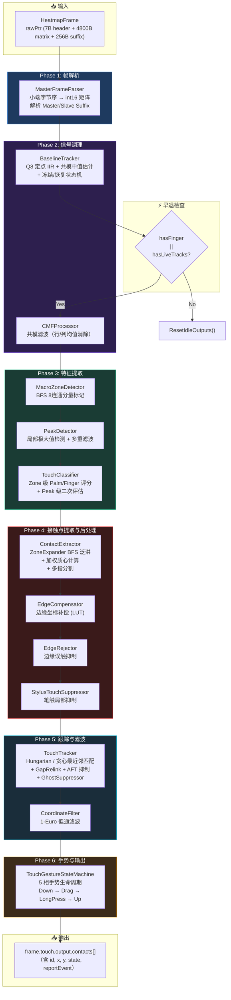

> [!IMPORTANT]
> 与旧版管线相比，`GridIIRProcessor`（时域门控 IIR）已被移除。信号调理阶段现在仅包含 `BaselineTracker` 和 `CMFProcessor`。`BaselineSubtraction` 已被重命名为 `BaselineTracker`，算法从简单的 EMA 更新升级为带共模中值估计的三层自适应 IIR。

---

## 2. Process() 执行流程

`Process()` 方法将帧处理分为 5 个内部方法调用：

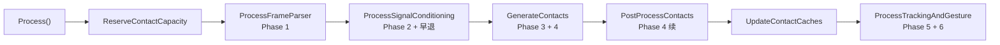

---

## 3. 各阶段详细分析

### Phase 1: 帧解析 — [MasterFrameParser](../EGoTouchService/Solvers/TouchSolver/MasterFrameParser.hpp)

| 项目 | 说明 |
|------|------|
| **输入** | `frame.rawPtr`（5063B = 7B header + 4800B matrix + 256B suffix） |
| **输出** | `frame.heatmapMatrix[40][60]`（int16_t），`frame.masterSuffix`，`frame.slaveSuffix` |
| **算法** | 逐单元小端无对齐加载（`raw_ptr[i*2] | raw_ptr[i*2+1]<<8`），MSVC O2 可自动向量化为 NEON |

---

### Phase 2: 信号调理

#### 2.1 [BaselineTracker](../EGoTouchService/Solvers/TouchSolver/BaselineTracker.hpp) — 自适应基线跟踪

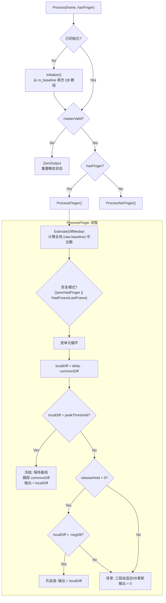

**核心机制：**
- **Q8 定点数基线**：`m_baselineQ8[i]` 使用 8 位小数精度，避免浮点运算
- **共模中值估计**：`EstimateDiffMedian()` 使用 `std::nth_element` 计算全场 `(raw - baseline)` 中位数，用于消除全局面板偏移（温度、VCOM 噪声）
- **冻结判定**：基于 `localDiff`（扣除共模后的残差）而非原始 `delta`
- **三层自适应 IIR**（`BackgroundBaselineUpdate`）：

| 层级 | 条件 | alphaShift | maxStep |
|------|------|------------|---------|
| 死区 | `|delta| ≤ noiseDeadband (90)` | `noiseAlphaShift (6)` | 1 |
| 正漂移 | `delta > positiveDeadband (14)` | `positiveAlphaShift (7)` | `positiveMaxStep (20)` |
| 负漂移 | `delta < -negativeDeadband (13)` | `negativeAlphaShift (5)` | `negativeMaxStep (20)` |
| 恢复模式 | `!prevHadFinger` 或无冻结帧 | `recoveryAlphaShift (2)` | `recoveryMaxStep (256)` |
| 无手指 | `hasFinger == false` | `noFingerAlphaShift (3)` | `noFingerMaxStep (512)` |

- **恢复模式**：`false→true` hasFinger 跳变或连续无冻结帧时激活，使用极快的 alpha（shift=2）追赶基线；在 `recoveryMaxFrames (30)` 帧后自动退出
- **Release Hold**：冻结解除后保持 `releaseHoldFrames (60)` 帧不更新基线，防止吸收手指抬起的负反冲
- **负逃逸**：Release Hold 期间若 `localDiff < -negativeDeadband`，直接透传负信号而非吸收

#### 2.2 [CMFProcessor](../EGoTouchService/Solvers/TouchSolver/CMFProcessor.hpp) — 共模滤波

| 维度 | 算法 |
|------|------|
| **行模式** | 每行排除 >`exclusionThreshold` 的单元 → 计算均值 → 全行减去均值 |
| **列模式** | 同理，按列维度 |
| **双维度** | 先行后列依次处理 |

- ARM64 使用 NEON SIMD 加速（`int16x8_t` 批量处理）
- `maxCorrection` 钳制最大校正量，防止过度补偿

> [!NOTE]
> 旧版管线中 Phase 2 还包含 `GridIIRProcessor`（时域门控 IIR 衰减），现已被移除。`BaselineTracker` 的共模中值估计和三层自适应 IIR 已完整覆盖了其功能。

---

### Phase 3: 特征提取

#### 3.1 [MacroZoneDetector](../EGoTouchService/Solvers/TouchSolver/MacroZoneDetector.hpp) — 宏区域检测

| 项目 | 说明 |
|------|------|
| **算法** | BFS 8-连通分量标记 |
| **阈值** | 使用 PeakDetector 的 `m_threshold` |
| **输出** | `vector<MacroZone>`，每个含 `pixels[]`（span）, `area`, `signalSum`, `bbox` |
| **优化** | 栈分配 BFS 队列（无堆分配），`visitEpoch` 纪元标记避免逐帧 memset |

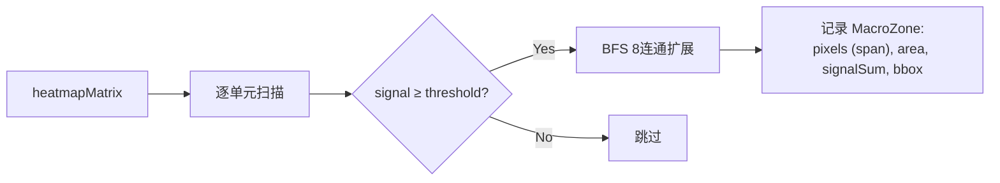

#### 3.2 [PeakDetector](../EGoTouchService/Solvers/TouchSolver/PeakDetector.hpp) — 峰值检测

这是管线中最复杂的检测模块，包含 **7 步流水线**：

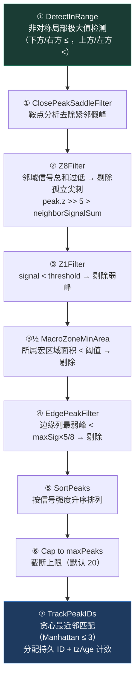

**PressureDrift 检测**（步骤 ① 中）：

| 条件 | 描述 |
|------|------|
| `peakSig` 在 `[3/8, 3/4] × sigTholdLimit` 范围内 | 信号中等 |
| 行无尖锐梯度突变 | 无局部凸起 |
| `signalSum ≥ peakSig × 9/2` | 信号分布平坦 |
| `peakSig × 6 ≥ gradientSum` | 梯度变化不显著 |
| → 判定为掌压漂移伪峰，剔除 | |

#### 3.3 候选分类 — [TouchClassifier](../EGoTouchService/Solvers/TouchSolver/TouchClassifier.hpp)

分类器执行 **双层评估**：Zone 级 + Peak 级。

##### 3.3.1 Zone 级特征分析

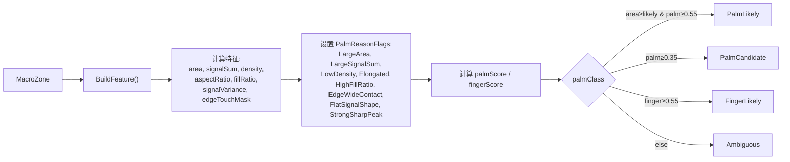

**Palm 评分权重表：**

| 条件 | 权重 |
|------|------|
| area ≥ areaThreshold (50) | +0.35 |
| area ≥ candidateArea (35) | +0.20 |
| signalSum ≥ signalSumThreshold (80000) | +0.25 |
| LowDensity | +0.15 |
| Elongated | +0.15 |
| HighFillRatio | +0.15 |
| EdgeWideContact | +0.10 |
| FlatSignalShape | +0.10 |
| **StrongSharpPeak（手指证据）** | **-0.20** |

##### 3.3.2 Peak 级评估

| 指标 | 计算方式 |
|------|----------|
| **prominence** | `peak.z - localMean5×5` |
| **sharpness** | `peak.z / localMean5×5` |
| **fingerScore** | prominence ≥ threshold (+0.45) + sharpness ≥ threshold (+0.35) + zone=FingerLikely (+0.20) |
| **palmScore** | zone.palmScore × 0.45 + flatPalmShape (+0.45) + inPalmZone & !strongFinger (+0.15) |

##### 3.3.3 跨帧 Palm Shadow

跨帧 `Palm Shadow` 机制已移除。当前 palm/finger 分类只使用当前帧的 `MacroZone` 特征和 `PeakEvaluation` 结果；不会再维护 `m_palmShadowAge`，也不会因历史 palm 区域与当前 zone 重叠而强制 `PalmLikely`。

---

### Phase 4: 接触点提取与后处理

#### 4.1 [ContactExtractor](../EGoTouchService/Solvers/TouchSolver/ContactExtractor.hpp) + [ZoneExpander](../EGoTouchService/Solvers/TouchSolver/ZoneExpander.hpp)

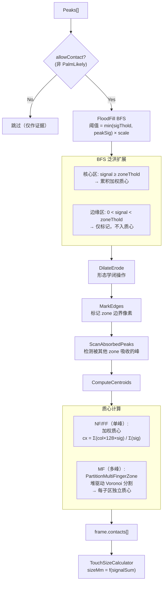

**Palm-Aware Expansion（手指在掌心中的特殊处理）：**
- 当 peak 被判为 `FingerLikely` 且 zone 为 `PalmCandidate/PalmLikely` 时
- 提高扩展阈值至 `peakSig × fingerInPalmThresholdRatio`（70%）
- 限制最大扩展半径为 `fingerInPalmMaxRadius`（3 格）
- 效果：在掌心检测到手指时，只扩展手指尖锐区域，不与掌域混合

#### 4.2 [EdgeCompensator](../EGoTouchService/Solvers/TouchSolver/EdgeCompensation.hpp) — 边缘坐标补偿

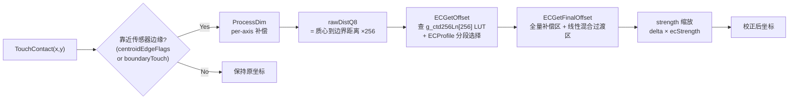

**LUT 原理**：使用 256 项对数表 `g_ctd256Ln[]` 实现非线性边缘补偿，模拟传感器边缘信号衰减曲线的逆映射。4 个边缘（上/下/左/右）各有独立的分段配置 `ECProfile`。

**EC 结果存储**：每个 contact 保留 `rawXBeforeEC` / `rawYBeforeEC` 原始坐标以及 `ecWidthX` / `ecWidthY` 边缘宽度，用于后续 EdgeRejector 和调试。

#### 4.3 [EdgeRejector](../EGoTouchService/Solvers/TouchSolver/EdgeCompensation.hpp#L403-L439) — 边缘误触抑制

新触摸（`state == 0`）如果 EC 未能校正且仍贴在边缘（`dist ≤ edgeMargin`），则标记为不上报（`isReported = false`）。

#### 4.4 [StylusTouchSuppressor](../EGoTouchService/Solvers/TouchSolver/StylusTouchSuppressor.hpp) — 笔触局部抑制

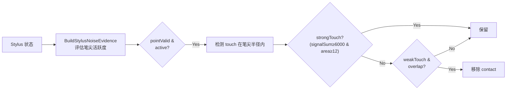

---

### Phase 5: 跟踪与滤波

#### 5.1 [TouchTracker](../EGoTouchService/Solvers/TouchSolver/TouchTracker.hpp) — 触摸跟踪器

这是管线中代码量最大（874 行）的模块：

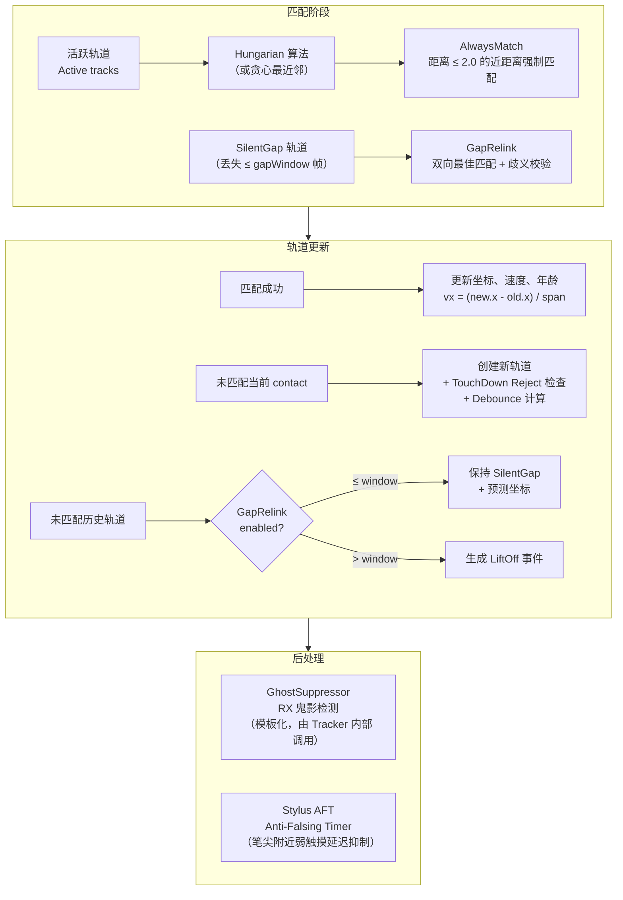

**关键参数：**

| 参数 | 默认值 | 作用 |
|------|--------|------|
| `maxTrackDistance` | 4.985 | 最大匹配搜索距离 |
| `alwaysMatchDistance` | 2.0 | 强制匹配距离（无需 gated） |
| `edgeTrackBoost` | 1.5× | 边缘区域匹配距离放大 |
| `accThresholdBoost` | 4.0× | 小触摸/边缘触摸的加速度门限放大 |
| `predictionScale` | 1.0 | 速度预测系数（v × scale） |
| `gapRelinkWindowFrames` | 4 | 间隙重连窗口 |
| `touchDownDebounceFrames` | 1 | 基础 TouchDown 去抖帧数 |
| `dynamicDebounceEnabled` | true | 动态去抖（弱信号/小面积/边缘额外加帧） |
| `touchDownDebounceMaxExtra` | 4 | 动态去抖最大附加帧数 |
| `useHungarian` | true | 使用匈牙利算法（否则贪心最近邻） |

**TouchDown Reject 逻辑：**
- 弱信号（< 55）+ 极小面积（< 0.95mm）→ 拒绝
- 边缘 + 弱信号（< 90）→ 拒绝

**GhostSuppressor**（模板化 — [GhostSuppressor.hpp](../EGoTouchService/Solvers/TouchSolver/GhostSuppressor.hpp)）：

| 参数 | 默认值 | 作用 |
|------|--------|------|
| `rxGhostFilterEnabled` | true | 启用 RX 鬼影过滤 |
| `rxGhostLineDelta` | 0 | 同一 RX 行判定距离阈值 |
| `rxGhostWeakRatio` | 0.5 | 弱触摸信号比率阈值 |
| `rxGhostOnlyNew` | true | 仅过滤新建触摸的鬼影 |

**Stylus AFT（Anti-Falsing Timer）**：

| 参数 | 默认值 | 作用 |
|------|--------|------|
| `stylusAftEnabled` | true | 启用笔尖附近弱触摸抑制 |
| `stylusAftRecentFrames` | 24 | 笔尖活跃记忆窗口 |
| `stylusAftRadius` | 2.8 | 抑制半径 |
| `stylusAftDebounceFrames` | 3 | 新触摸去抖帧数 |
| `stylusAftWeakSignalThreshold` | 240 | 弱信号判定阈值 |
| `stylusAftWeakSizeThresholdMm` | 1.2 | 弱触摸尺寸阈值 |
| `stylusAftSuppressFrames` | 40 | 弱触摸抑制帧数 |
| `stylusAftPalmSuppressFrames` | 100 | 掌触摸抑制帧数 |
| `stylusAftPalmAreaThreshold` | 20 | 掌触判定面积 |
| `stylusAftPalmSizeThresholdMm` | 2.5 | 掌触判定尺寸 |

#### 5.2 [CoordinateFilter](../EGoTouchService/Solvers/TouchSolver/CoordinateFilter.hpp) — 1-Euro 低通滤波

$$\alpha = \frac{1}{1 + \tau \cdot rate}, \quad \tau = \frac{1}{2\pi \cdot cutoff}$$

$$cutoff = minCutoff + \beta \cdot |\dot{v}|$$

| 参数 | 默认值 | 效果 |
|------|--------|------|
| `minCutoff` | 4.404 | 静止时平滑强度（值越小越平滑） |
| `beta` | 0.5 | 速度自适应系数（值越大运动时延迟越低） |
| `dCutoff` | 1.0 | 速度估计的平滑截止频率 |

> [!NOTE]
> 相较旧版（`minCutoff=5.0`, `beta=0.05`），新默认值显著降低了运动延迟。`beta` 从 0.05 提高到 0.5，意味着手指移动时频率截止点上升更快、滤波更少。

---

### Phase 6: 手势与输出

#### 6.1 [TouchGestureStateMachine](../EGoTouchService/Solvers/TouchSolver/TouchGestureStateMachine.hpp) — 手势状态机

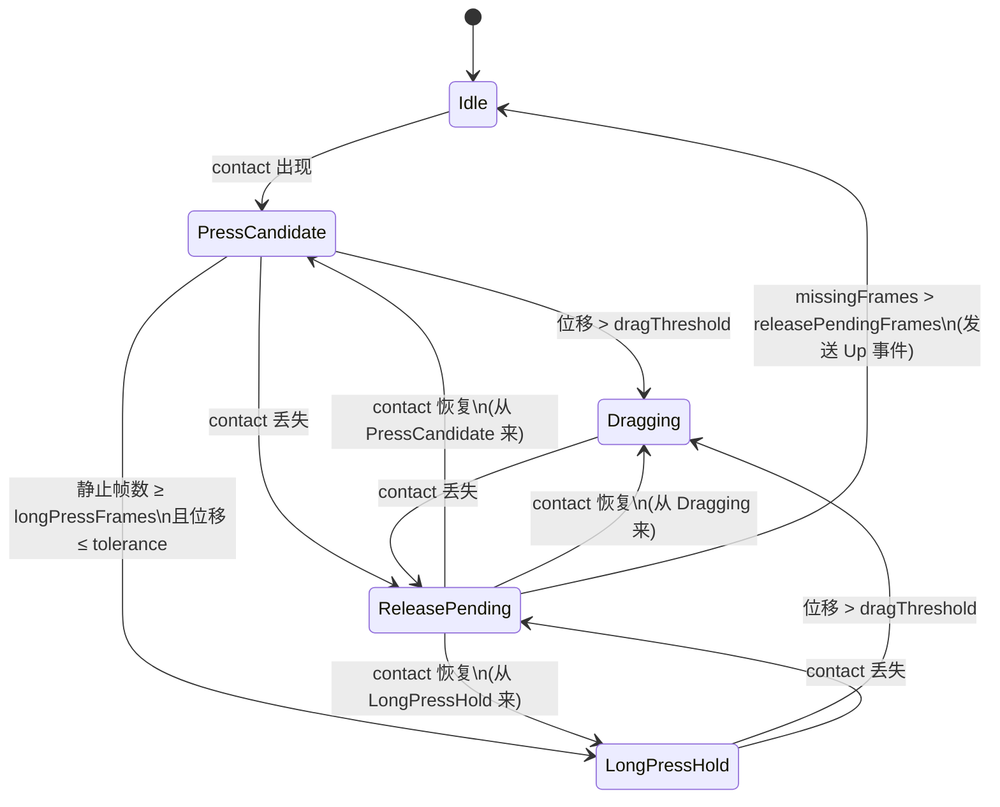

**报告事件映射：**

| 状态 | 报告 |
|------|------|
| `Idle` | 不报告 |
| `PressCandidate` (stableFrames ≥ N) | `TouchReportDown` |
| `PressCandidate` (stableFrames < N) | 不报告（消抖中） |
| `Dragging` | `TouchReportMove` |
| `LongPressHold` | `TouchReportMove`（坐标锁定在 anchor） |
| `ReleasePending → Idle` | `TouchReportUp` |

---

## 4. 关键数据结构

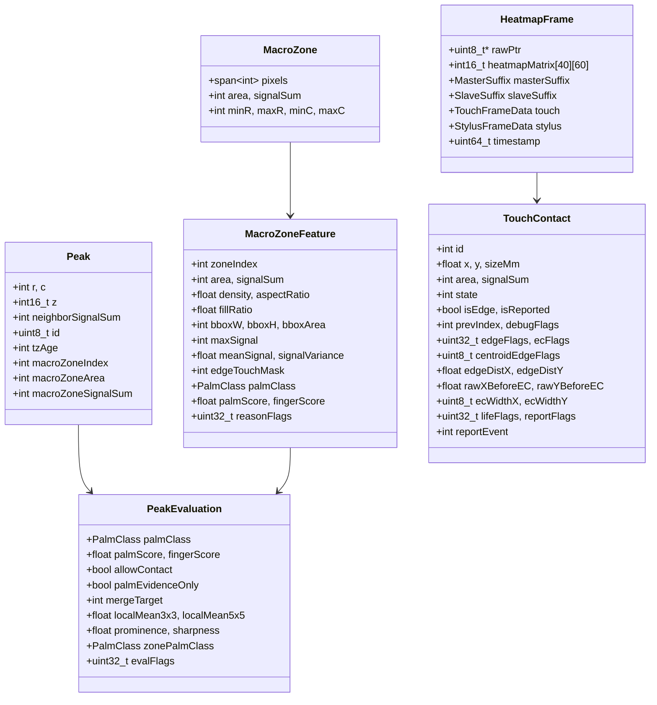

---

## 5. 模块依赖关系

```mermaid
graph LR
    MFP["MasterFrameParser"] --> BL["BaselineTracker"]
    BL --> CMF["CMFProcessor"]
    CMF --> MZD["MacroZoneDetector"]
    MZD --> PD["PeakDetector"]
    PD --> TC["TouchClassifier"]
    MZD --> TC
    TC --> CE["ContactExtractor"]
    PD --> CE
    CE --> EC["EdgeCompensator"]
    CE --> ER["EdgeRejector"]
    EC --> STS["StylusTouchSuppressor"]
    ER --> STS
    STS --> TT["TouchTracker"]
    TT --> GS["GhostSuppressor"]
    TT --> CF["CoordinateFilter"]
    CF --> GSM["GestureStateMachine"]

    TC -.-|"palmAwareExpansion<br/>参数同步"| CE
    TT -.-|"stylus 参数同步"| STS
    PD -.-|"threshold"| MZD

    style MFP fill:#1e3a5f,color:#fff
    style BL fill:#2d1f4e,color:#fff
    style CMF fill:#2d1f4e,color:#fff
    style MZD fill:#1a3c34,color:#fff
    style PD fill:#1a3c34,color:#fff
    style TC fill:#1a3c34,color:#fff
    style CE fill:#3a1a1a,color:#fff
    style EC fill:#3a1a1a,color:#fff
    style ER fill:#3a1a1a,color:#fff
    style STS fill:#3a1a1a,color:#fff
    style TT fill:#1a2d3a,color:#fff
    style CF fill:#1a2d3a,color:#fff
    style GSM fill:#3d2c1a,color:#fff
    style GS fill:#1a2d3a,color:#fff
```

> [!NOTE]
> 虚线箭头表示配置参数的跨模块同步，而非运行时数据流。

---

## 6. 配置系统

> Historical note: 本节旧版曾描述 `EGOTOUCH_CONFIG_ENABLED`、`TouchPipelineConfigKeys.h/.cpp` 与 `GetConfigSchema/SaveConfig/LoadConfig` 并存。该描述已由 Config v3 取代；当前权威见 [config_framework_api.md](api/config_framework_api.md)。

当前 Touch pipeline 配置通过 `TouchPipeline::registerBindings()` 注册到 `ConfigBinder`，由 `ConfigRuntime` / v3 IPC 负责 snapshot、patch 与 persist。本地 YAML/binder 路径只作为 App 离线预览或 Service 不可用 fallback。

| 机制 | 条件 | 实现 |
|------|------|------|
| **Config v3 binding** | 当前产品路径 | [TouchPipeline.cpp](../EGoTouchService/Solvers/TouchSolver/TouchPipeline.cpp) 中 `registerBindings()` / `applyConfig()` |
| **冻结键保护** | 始终生效 | `IsFrozenCurrentTouchConfigKey()` — 二分查找 117 个已冻结键名 |
| **KeyId map** | v3 IPC patch/snapshot | [ConfigKeyId.h](../Common/include/config/ConfigKeyId.h) / [ConfigKeyMap.cpp](../Common/source/config/ConfigKeyMap.cpp) |

---

## 7. 文件清单

| 文件 | 大小 | 阶段 | 职责 |
|------|------|------|------|
| [TouchPipeline.h](../EGoTouchService/Solvers/TouchSolver/TouchPipeline.h) | 4.9KB | 编排 | 管线声明、成员持有所有模块 |
| [TouchPipeline.cpp](../EGoTouchService/Solvers/TouchSolver/TouchPipeline.cpp) | 92KB | 编排/配置 | Process() + `registerBindings()` + `applyConfig()` |
| [MasterFrameParser.hpp](../EGoTouchService/Solvers/TouchSolver/MasterFrameParser.hpp) | 2.1KB | P1 | 帧解析 |
| [BaselineTracker.hpp](../EGoTouchService/Solvers/TouchSolver/BaselineTracker.hpp) | 16.8KB | P2 | 自适应基线跟踪 |
| [CMFProcessor.hpp](../EGoTouchService/Solvers/TouchSolver/CMFProcessor.hpp) | 6.5KB | P2 | 共模滤波 |
| [MacroZoneDetector.hpp](../EGoTouchService/Solvers/TouchSolver/MacroZoneDetector.hpp) | 5.1KB | P3 | BFS 连通分量 |
| [PeakDetector.hpp](../EGoTouchService/Solvers/TouchSolver/PeakDetector.hpp) | 19KB | P3 | 峰值检测 |
| [MSType.hpp](../EGoTouchService/Solvers/TouchSolver/MSType.hpp) | 1.8KB | 公共 | Peak / MacroZoneFeature / PeakEvaluation 结构体 |
| [TouchClassifier.hpp](../EGoTouchService/Solvers/TouchSolver/TouchClassifier.hpp) | 15.4KB | P3 | Palm/Finger 分类 |
| [ContactExtractor.hpp](../EGoTouchService/Solvers/TouchSolver/ContactExtractor.hpp) | 5.5KB | P4 | 微区分割 + 外壳 |
| [ZoneExpander.hpp](../EGoTouchService/Solvers/TouchSolver/ZoneExpander.hpp) | 31KB | P4 | BFS 泛洪 + 质心 + 多指分割 |
| [EdgeCompensation.hpp](../EGoTouchService/Solvers/TouchSolver/EdgeCompensation.hpp) | 19.7KB | P4 | 边缘补偿 LUT + 拒绝器 |
| [StylusTouchSuppressor.hpp](../EGoTouchService/Solvers/TouchSolver/StylusTouchSuppressor.hpp) | 7.4KB | P4 | 笔触抑制 |
| [TouchTracker.hpp](../EGoTouchService/Solvers/TouchSolver/TouchTracker.hpp) | 37.8KB | P5 | 多触摸跟踪 + AFT + 鬼影抑制 |
| [GhostSuppressor.hpp](../EGoTouchService/Solvers/TouchSolver/GhostSuppressor.hpp) | 3.7KB | P5 | RX 鬼影抑制（模板化） |
| [CoordinateFilter.hpp](../EGoTouchService/Solvers/TouchSolver/CoordinateFilter.hpp) | 3.2KB | P5 | 1-Euro 滤波 |
| [TouchGestureStateMachine.hpp](../EGoTouchService/Solvers/TouchSolver/TouchGestureStateMachine.hpp) | 11.5KB | P6 | 手势状态机 |
