# TSA_MSProcess 手指解算管线架构分析

> 逆向对象：`TSACore.dll`（image base `0x6ba40000`，x86-64）
> 入口函数：`TSA_MSProcess @ 0x6ba90e43`
> 项目预设：`W273AS2700`（Gaokun Himax CSOT，40 RX × 60 TX）
> 配置来源：`g_tsaPrmtFlashGaokunHimaxCSOT`（经 `tsaprmt-table-reader` 实测确认）

---

## 1. 概述

`TSA_MSProcess` 是**互容（Mutual-Sensing）手指触摸**的逐帧解算管线入口，由上层逐帧驱动 `TSA_Processing` 在 `FLAG_SKIP_MS_PROCESS` 未置位时调用。它把 AFE 采集的一帧 **40×60 互容原始矩阵**，经过「原始预处理 → 基线差分/共模滤除/网格 IIR → 峰值检测 → 触摸跟踪与 ID 分配 → 事件生成 → 上报」一整条链路，最终产出可上报的触点集合。

本机当前预设下，管线呈现一条**精简的有效路径**，多个特性分支在 Flash 参数中被关闭。下表是经实测确认的关键开关：

| 参数 | 偏移 | 实测值 | 含义 / 对管线的影响 |
|------|------|--------|---------------------|
| `bCols` | `0x1d` | `0x3C` = 60 | 传感器列数（TX）|
| `bRows` | `0x1e` | `0x28` = 40 | 传感器行数（RX）|
| `wBufElementCount` | `0x2c` | `0x0960` = 2400 | 网格元素总数（60×40），所有缓冲拷贝以它为长度 |
| `dwPeakProcessingMode` | `0x34` | `3` | 峰值检测走 **Mode 3**（Z8→全内嵌SD判定→Z1）|
| `bCmfEnabled` | `0x68` | `0` | CMF **关闭** → 走 fallback：`Rawdata_CMF` 跳过，改在后段 `CMF_Process` 运行 |
| `bCmfForceDim1Pass` | `0x19` | `1` | CMF 强制**一维通道**（不做 2D 滤波）|
| `dwCmfMethodNormal` | `0x810` | `0` | 正常场景 CMF method=0 → 走 `CMF_ProcessDim`（非 `CMF_Filter2D`）|
| `dwCmfMethodSmartCover` | `0x814` | `2` | 智能保护套场景才用 method 2 |
| `wPeakMode3ThresholdMax` | `0x5b6` | `0x0258` = 600 | Mode 3 动态阈值上限，运行时用其 **一半 (300)** 做钳制 |
| `wPeakFilterReferenceThreshold` | `0x5b4` | `0x0BB8` = 3000 | 峰值滤波参考阈值 |
| `dwAftModeFeatureMask` | `0x60` | `0` | AFT 模式掩码为 0 |
| `bRawdataForceNormalize` | `0x604` | `0` | 不强制归一化 |

> **运行时禁用的分支**（来自反编译条件判定，非 Flash 静态值）：`Rawdata_CMF`、`SafeBaseline_*`、`Exception_CheckUnderWater`、`SignalDisparity_PostProcess`、`AFT_Process`、`SmartCover_Process`。这些都受 `dwFeatureFlags` 运行时位控制，当前路径不进入。

---

## 2. 管线在系统中的位置

`TSA_MSProcess` 不是最外层入口，它被逐帧驱动 `TSA_Processing @ 0x6ba9a623` 包裹。手指解算（MS）与手写笔解算（ASA）在同一帧内顺序执行——**ASA 链路（手写笔）不在本报告范围内**。

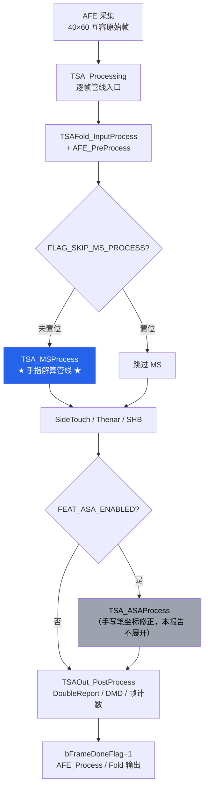

---

## 3. TSA_MSProcess 总体流程

整条管线分为 6 个逻辑阶段。下图展示主路径与三条提前退出/保持上一帧的旁路。

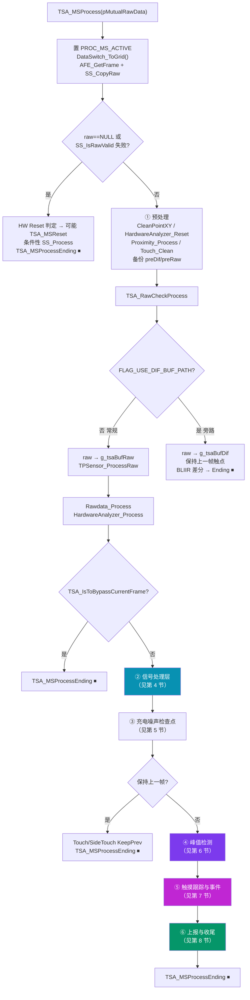

---

## 4. 信号处理层（baseline / CMF / IIR）

进入信号处理层前先调用 `TSAPrmt_PreProcess` 与 `SS_Process`（自容/Side 通道的差分、IIR、CMF、属性提取）。随后是手指主通道的差分与滤波链。**当 `FLAG_USE_DIF_BUF_PATH` 未置位时**走完整链路：

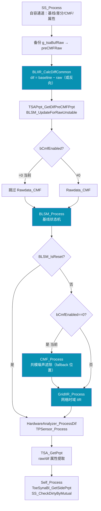

### 4.1 BLIIR_CalcDiffCommon（差分）`ordinal 346`

逐元素计算差分图，方向由 `g_tsaStaticPtr->bField_0x11a` 决定，长度为 `wBufElementCount`（2400）：

```
bField_0x11a == 0 : dif[i] = baseline[i] − raw[i]   （常规）
bField_0x11a != 0 : dif[i] = raw[i] − baseline[i]   （反向）
```

### 4.2 BLSM_Process（基线状态机）`ordinal 380`

基线管理核心，依次执行四步子流程，并根据**硬件复位**与**强制刷新**两个入参/静态锁存位选择基线属性：

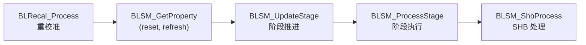

- `bForceBaselineProperty` 或静态位 `(*g_tsaStaticPtr)[1].field_0x2` → 触发属性刷新
- `bHardwareReset` 或静态位 `(*g_tsaStaticPtr)[1].field_0x1` → 触发基线复位属性
- `TSA_MSProcess` 中按 `TSAStatic_IsHWReset()` 结果传入 `BLSM_Process(true,false)` 或 `BLSM_Process(false,false)`

### 4.3 CMF_Process（共模噪声滤除）`ordinal 478`

在 `bCmfEnabled=0` 的当前配置下，CMF 不在 `Rawdata_CMF` 阶段执行，而是作为 **fallback 落到 BLSM 之后**。其内部分支由 `CMF_GetCmfMethod()` 决定：

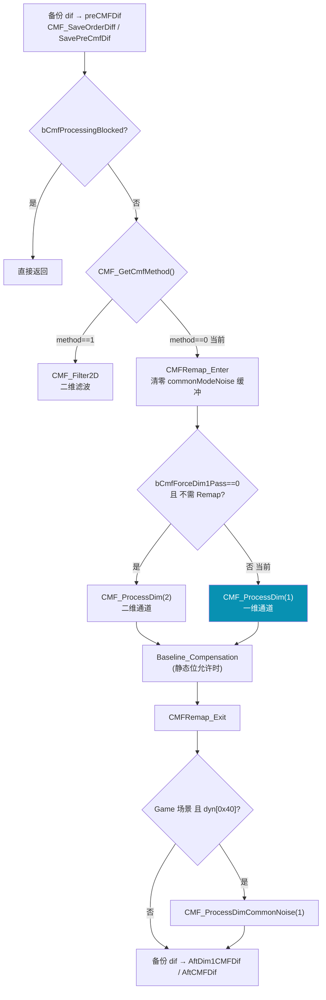

> 实测 `dwCmfMethodNormal=0` + `bCmfForceDim1Pass=1` ⇒ 当前帧固定走 **`CMF_ProcessDim(1)` 一维通道**，二维滤波路径在普通场景不触发。

### 4.4 GridIIR_Process（网格时域 IIR）`ordinal 637`

仅在频点判定为噪声时介入，对 dif 做时域平滑：

```
TSAStatic_IsAllFreqBecomeNoisy() == true  : 直接 memcpy(dif → GridIIRDif)，不滤波
否则 IsAllFreqNoisy() == true              : GridIIR_ProcessCore(dif, dif, GridIIRDif, ...)
两者皆否                                    : 不处理
```

IIR 系数取自 `g_tsaPrmtFlash[1].pDim1PitchMap + 3`（运行时滤波参数字节）。

---

## 5. 充电噪声检查点

信号处理后、峰值检测前，管线判定是否因充电器噪声或 bypass 而**保持上一帧触点**：

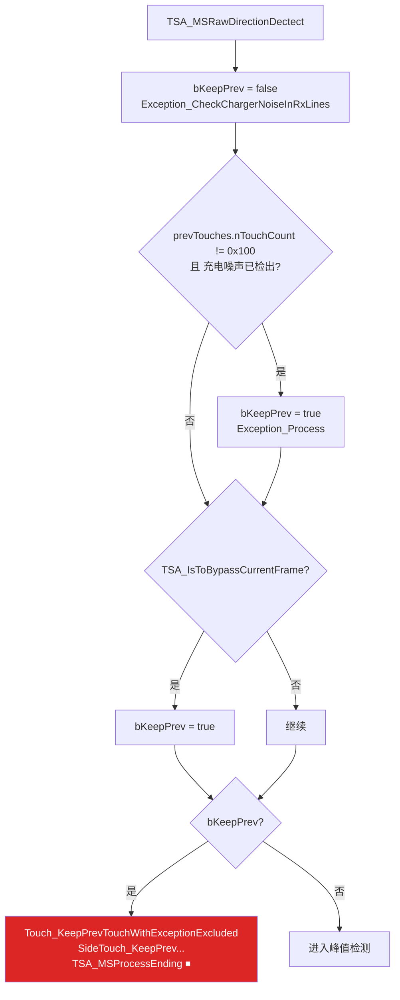

---

## 6. 峰值检测层

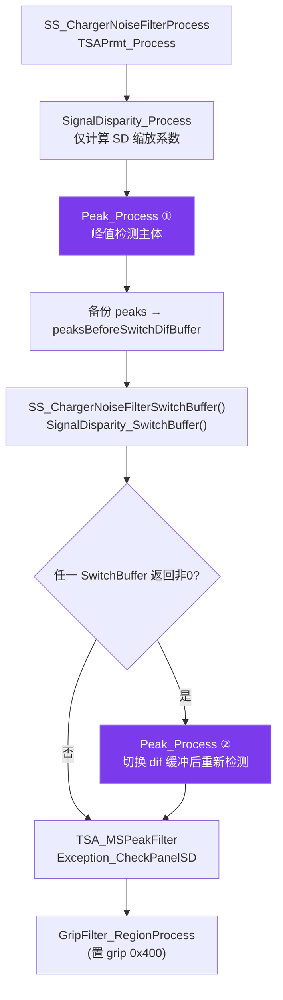

### 6.1 Peak_Process（峰值检测主体）`ordinal 992`

当前 `dwPeakProcessingMode=3`，核心步骤：

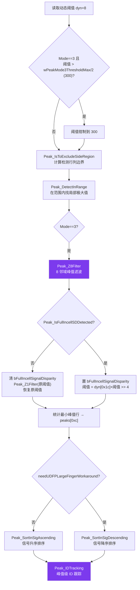

> Mode 2 路径（非当前）：当 `SignalDisparity_IsOKToProcess` 且峰值数 > 2 时，用 `Peak_GetMaxPeak()/3` 再做一次 Z1 滤波。

### 6.2 SignalDisparity_Process（信号差异）`ordinal 1419`

当前仅**计算 SD 缩放系数**并取两种估计的较小值写入静态区；因 `FEAT_SIGNAL_DISPARITY_POST` 关闭，`SignalDisparity_Compensation` 补偿与后处理均跳过：

```
scale = min( GetSDScalingByScoring(), GetSDScalingBySignalRatio() )
→ 写入 (*g_tsaStaticPtr)[1].field_0x12
```

---

## 7. 触摸跟踪与事件层

这是把「峰值」转换为「带稳定 ID 的触点轨迹」并生成 down/move/up 事件的核心。触点结构步长 `0x168`（360B），上一帧触点步长 `0x478`（1144B）。

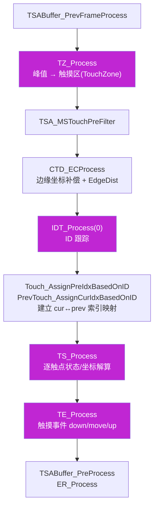

### 7.1 TZ_Process（触摸区生成）`ordinal 2439`

把当前峰值转换为触摸区；当 grip flag `0x200` 置位时额外做峰值 TZ 的年龄（age）处理：

```
if (gripFlags & 0x200) TZ_UpdatePeakTzAge();
touches.count = 0;
TZ_PeakBasedProcess();          // 基于峰值建立触摸区
if (gripFlags & 0x200) TZ_AgeProcess();
```

### 7.2 IDT_Process（ID 跟踪）`ordinal 886`

用 20 字节临时映射表，串联三步实现帧间 ID 关联：

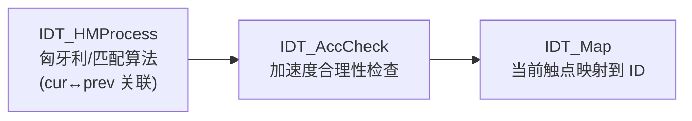

### 7.3 TS_Process（触点状态解算）`ordinal 2349`

逐触点调用 `TS_ProcessUnit(prevIdx, curIdx)` 完成坐标/状态精算；跳过状态位 `0x20`（offset `+0x21c`）已置位的触点。

### 7.4 TE_Process（触摸事件）`ordinal 1461`

生成 down/move/up 事件。**当前 WindowsPad 特性启用**，因此抬起走 `TE_WindowsLiftOffProcess`：

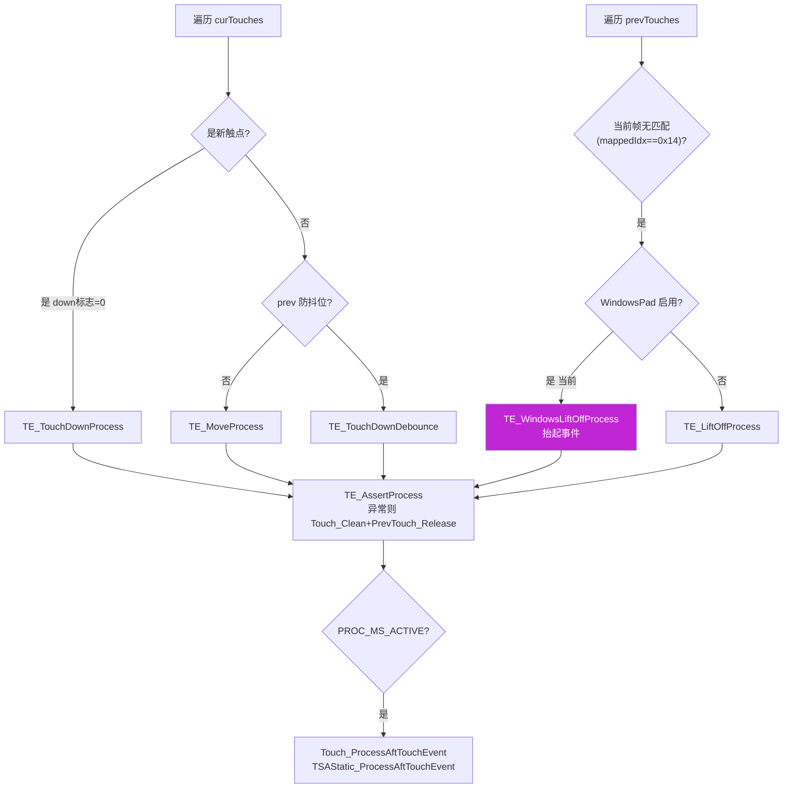

---

## 8. 上报与收尾层

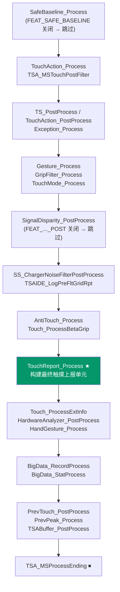

### 8.1 TouchReport_Process（最终上报）`ordinal 2501`

逐触点调用 `TouchReport_ProcessUnit(curIdx, prevIdx)` 生成上报单元；当 multi-step-back 启用且**全部触点正在回退**时，用上一帧坐标（prev offset `+0x594/+0x596`）回填当前触点坐标（`+0x170/+0x172`），避免回退抖动。

---

## 9. 完整数据缓冲流转

下图汇总一帧数据在各全局缓冲间的流转（缓冲名取自 `_refptr_g_tsaBuf*`）：

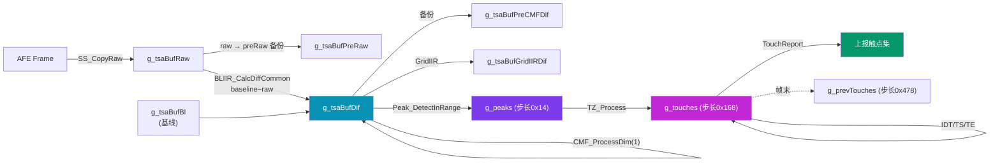

---

## 10. 关键函数索引

| 阶段 | 函数 | 相对偏移 | ordinal | 职责 |
|------|------|---------|---------|------|
| 入口 | `TSA_Processing` | `0x5a443` | 2122 | 逐帧管线驱动（MS + ASA + 输出）|
| 入口 | `TSA_MSProcess` | `0x50e43` | — | 手指互容解算管线主体 |
| 信号 | `BLIIR_CalcDiffCommon` | `0x6f4c` | 346 | 基线差分图计算 |
| 信号 | `BLSM_Process` | — | 380 | 基线状态机（重校准/属性/阶段/SHB）|
| 信号 | `CMF_Process` | `0xf2c8` | 478 | 共模噪声滤除（当前一维通道）|
| 信号 | `GridIIR_Process` | `0x21098` | 637 | 噪声帧网格时域 IIR |
| 信号 | `SS_Process` | `0xc0e4e` | 1202 | 自容通道差分/IIR/CMF/属性 |
| 信号 | `TSA_GetPrpt` | `0x61353` | 1975 | raw/dif 属性提取 |
| 峰值 | `Peak_Process` | `0x28c4b` | 992 | 峰值检测主体（Mode 3）|
| 峰值 | `SignalDisparity_Process` | `0xf5d84` | 1419 | 信号差异缩放系数 |
| 跟踪 | `TZ_Process` | `0x4c9f0` | 2439 | 峰值 → 触摸区 |
| 跟踪 | `CTD_ECProcess` | `0x15ca0` | 490 | 边缘坐标补偿 |
| 跟踪 | `IDT_Process` | `0x211a6` | 886 | 帧间 ID 跟踪 |
| 跟踪 | `TS_Process` | `0x3c2cb` | 2349 | 触点状态/坐标解算 |
| 跟踪 | `TE_Process` | `0x389d9` | 1461 | 触摸事件 down/move/up |
| 上报 | `TouchReport_Process` | `0x3be73` | 2501 | 构建最终上报单元 |

> 相对偏移取自各函数反编译头部 `/* <偏移> <ordinal> <名称> */` 注释；`TSA_MSProcess` 绝对地址 `0x6ba90e43`，叠加 image base `0x6ba40000` 反推相对偏移 `0x50e43`。`TSA_Processing` 绝对地址 `0x6ba9a623`。

---

## 11. 小结

当前 `W273AS2700` 预设下，手指解算管线是一条**经过裁剪的高效路径**：

1. **差分主导**：`BLIIR_CalcDiffCommon` 产出差分图，基线由 `BLSM` 状态机维护。
2. **CMF 走 fallback 一维通道**：`bCmfEnabled=0` 使共模滤除推迟到 BLSM 之后，且 `bCmfForceDim1Pass=1` + `method=0` 锁定为 `CMF_ProcessDim(1)`。
3. **峰值 Mode 3**：动态阈值钳制（上限 300）+ Z8 邻域滤波 + 全内嵌 SD 判定 + Z1 滤波 + 峰值级 ID 跟踪。
4. **双次峰值检测**：充电噪声/SD 切换缓冲后会重跑一次 `Peak_Process`。
5. **跟踪链完整**：TZ → 边缘补偿 → IDT(匈牙利匹配+加速度检查) → TS → TE(WindowsPad 抬起)。
6. **多特性关闭**：UnderWater / SafeBaseline / SignalDisparity-Post / AFT / SmartCover 均不在当前路径。

所有 Flash 静态开关均经 `tsaprmt-table-reader` 实测，与反编译条件判定一致。
